# Репозиторий лабороторных работ по дисциплине "Язык программирования C++"

# Лаб. №1 в файле main.cpp

# Группа: ИТ-5-2024

# ФИО: Чугаев Евгений Игоревич

# Описание лабораторной:

Решение всех задач оформить в виде функций, решающими поставленные задачи. В главнойфункцииmainорганизовать  вызов  всех функцийс  дружественным интерфейсом.  Если  исходные  данные  вводятся  с  клавиатуры,  то  организовать проверку на ввод.Первое задание предполагает исследование базовой информации по работе с типами данных.  Второе  задание  позволяет  отработать  навыки  применения  условий  с использованием инструкций if и switch. Третье задание позволяет отработать навыки работы  с циклами через инструкции for и while. Четвертое задание предлагает отработать навыки решения типовых алгоритмов на массивах.Необходимо решить  по 5 задач из  каждого  задания согласно вашему варианту. Каждое задание оценивается по 0,4 балла. Максимально за лабораторную работу можно получить 10 баллов (8 баллов за решение задач + 2 балла за оформление отчета).

## Задание 1. Методы

### 2. Сумма знаков.

#### Описание:

Дана сигнатура функции:intsumLastNums(intx);Необходимо  реализовать функциютаким  образом,  чтобы она  возвращаларезультат сложения двух последних знаков числах, предполагая, что знаков в числе не менее двух. Подсказки:intx=123%10; // х будет иметь значение 3intу=123/10; // у будет иметь значение 12

#### Алгоритм решения:

Если число отрицательное, то меняем знак.

Возращаем сумму чисел, получившуюся из остатка от деления числа на 10 и отстатка от деления на 10, числа  получившегося при делении без остатка.

#### Код:

```
int sumLastNums(int x){ // 1 2
    if (x < 0) x = -x;
    return (x % 10) + (x % 100 / 10);
}
```

intsumLastNums(intx){ // 1 2

if (x < 0) x = -x;

return (x % 10) + (x % 100 / 10);

}

#### Тестирование:

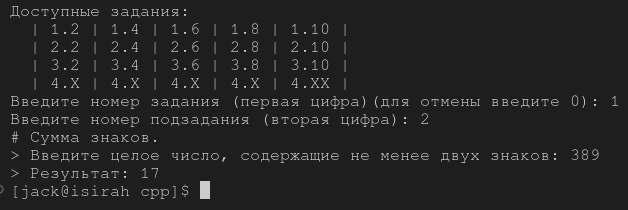

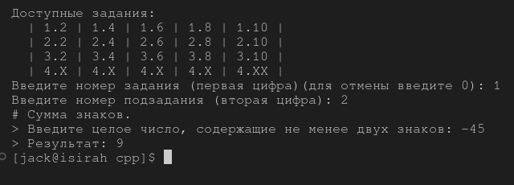

### 4. Есть ли позитив.

#### Описание:

Дана сигнатура функции:boolisPositive(intx);Необходимо реализовать функциютаким образом, чтобы онапринималачисло xи возвращалаtrue, если оно положительное.

#### Алгоритм решения:

Если число положительное, то возращаем ``true``.

В противном случае - ``false``.

#### Код:

```
bool isPositive(int x){ // 1 4
    return (x >= 0)? true : false;
}
```

#### Тестирование:

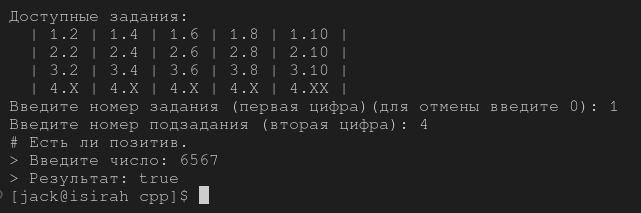

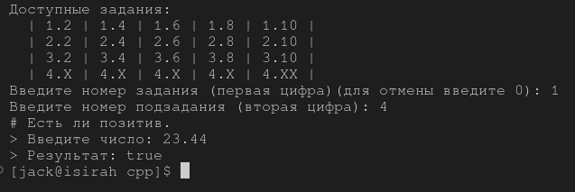

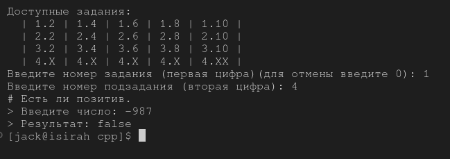

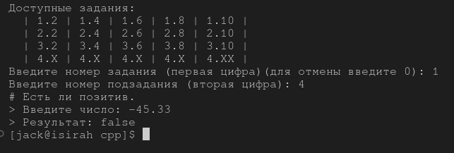

### 6. Большая буква.

#### Описание:

Данасигнатурафункции:boolisUpperCase(charx);Необходимо  реализовать функциютаким  образом,  чтобы  онапринималасимвол xи возвращалаtrue, если это большая буква в диапазоне от ‘A’ до ‘Z’.

#### Алгоритм решения:

Если символ **x** больше символа **A**, но меньше символа **B**, то возращаем ``true``.

Иначе - ``false``.						

#### Код:

```
bool isUpperCase(char x){ // 1 6
    return (x >= 'A' && x <= 'Z')? true : false;
}
```

#### Тестирование:

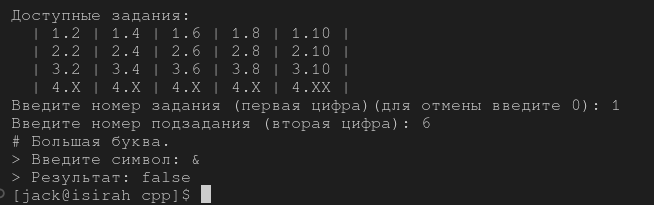

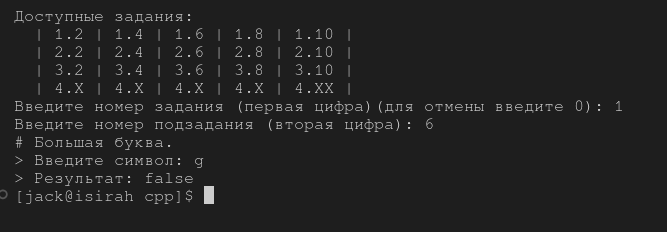

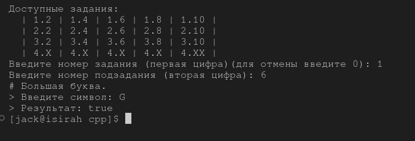

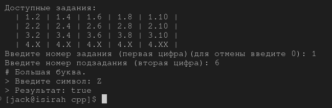

### 8. Делитель.

#### Описание:

Данасигнатурафункции:boolisDivisor(inta, intb);Необходимо реализовать функциютаким образом, чтобы она возвращалаtrue, если любое из принятых чисел делит другое нацело.

#### Алгоритм решения:

Если число **a** делится на **b** без остатка или число **b** делится на **a** без остатка, то возращаем ``true``.

Иначе - ``false``.

#### Код:

```
bool isDivisior(int a, int b){ // 1 8 
    return (a % b == 0 || b % a == 0)? true : false;
}
```

#### Тестирование:

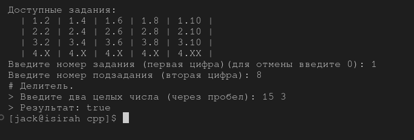

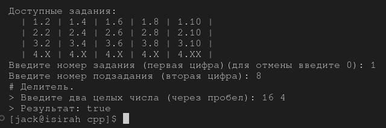


### 10. Многократный вызов.

#### Описание:

Данасигнатурафункции:int lastNumSum(int a, int b)Необходимо реализовать функциютаким образом, чтобы онасчиталасумму цифр  двух  чисел  из  разряда  единиц.  Выполните  с  его  помощью последовательное  сложение  пяти  чисел  и  результат  выведите  на  экран. Постарайтесь  выполнить  задачу,  используя  минимально  возможное количество вспомогательных переменных.

#### Алгоритм решения:

Если число **a** отрицательно, меняем у него знак.

Если число **b** отрицательно, меняем у него знак.

Возращаем сумму от остатков делений чисел **a** и **b** на 10.

(Функция последовательно вызывается в ``int main()``))

#### Код:

```
int lastNumSum(int a, int b){ // 1 10
    if (a < 0) a = -a;
    if (b < 0) b = -b;
    return (a % 10) + (b % 10);
}
```

#### Тестирование:

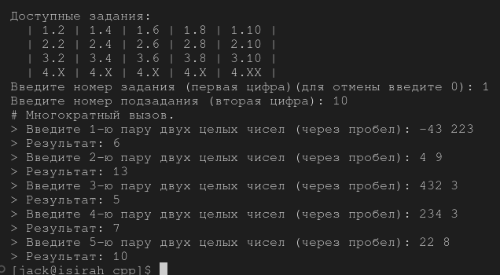

## Задание 2. Условия.

### 2.

#### Описание:

#### Алгоритм решения:

#### Код:

#### Тестирование:

### 4.

#### Описание:

#### Алгоритм решения:

#### Код:

#### Тестирование:

### 6.

#### Описание:

#### Алгоритм решения:

#### Код:

#### Тестирование:

### 8.

#### Описание:

#### Алгоритм решения:

#### Код:

#### Тестирование:

### 10.

#### Описание:

#### Алгоритм решения:

#### Код:

#### Тестирование:

## Задание 3.

### 2.

#### Описание:

#### Алгоритм решения:

### 4.

#### Описание:

#### Алгоритм решения:

#### Код:

#### Тестирование:

### 6.

#### Описание:

#### Алгоритм решения:

#### Код:

#### Тестирование:

### 8.

#### Описание:

#### Алгоритм решения:

#### Код:

#### Тестирование:

### 10.

#### Описание:

#### Алгоритм решения:

#### Код:

#### Тестирование:

## Задание 4.

### 2.

#### Описание:

#### Алгоритм решения:

### 2.

#### Описание:

#### Алгоритм решения:

#### Код:

#### Тестирование:

### 2.

#### Описание:

#### Алгоритм решения:

#### Код:

#### Тестирование:

### 2.

#### Описание:

#### Алгоритм решения:

#### Код:

#### Тестирование:

### 2.

#### Описание:

#### Алгоритм решения:

#### Код:

#### Тестирование:
