# Репозиторий лабороторных работ по дисциплине "Язык программирования C++"

# Лаб. №1 в файле main.cpp

# Группа: ИТ-5-2024

# ФИО: Чугаев Евгений Игоревич

# Описание лабораторной:

Решение всех задач оформить в виде функций, решающими поставленные задачи. В
главной функции main организовать вызов всех функций с дружественным
интерфейсом. Если исходные данные вводятся с клавиатуры, то организовать
проверку на ввод.
Первое задание предполагает исследование базовой информации по работе с типами
данных. Второе задание позволяет отработать навыки применения условий с
использованием инструкций if и switch. Третье задание позволяет отработать навыки
работы с циклами через инструкции for и while. Четвертое задание предлагает
отработать навыки решения типовых алгоритмов на массивах.
Необходимо решить по 5 задач из каждого задания согласно вашему варианту.
Каждое задание оценивается по 0,4 балла. Максимально за лабораторную работу
можно получить 10 баллов (8 баллов за решение задач + 2 балла за оформление
отчета).

```
int main(){
	setlocale(LC_ALL, "rus");
    int majorTaskChoice, minorTaskChoice;

    cout << "Доступные задания:\n  | 1.2 | 1.4 | 1.6 | 1.8 | 1.10 |\n  | 2.2 | 2.4 | 2.6 | 2.8 | 2.10 |\n  | 3.2 | 3.4 | 3.6 | 3.8 | 3.10 |\n  | 4.X | 4.X | 4.X | 4.X | 4.XX |\n"
         << "Введите номер задания (первая цифра)(для отмены введите 0): ";
    cin >> majorTaskChoice;
    cout << "Введите номер подзадания (вторая цифра): ";
    cin >> minorTaskChoice;

    switch (majorTaskChoice){
        /* 
        Задание 1. МЕТОДЫ
        */
        case 1: switch (minorTaskChoice){
            case 2:{
                cout << "# Сумма знаков.\n";
                cout << "> Введите целое число, содержащие не менее двух знаков: ";
                int x;
                cin >> x;
                cout << "> Результат: " << sumLastNums(x) << endl;

            }; break;
        
            case 4:{
                cout << "# Есть ли позитив.\n";
                cout << "> Введите число: ";
                float x;
                cin >> x;
                cout << boolalpha;
                cout << "> Результат: " << isPositive(x) << endl;

            }; break;

            case 6:{
                cout << "# Большая буква.\n";
                cout << "> Введите символ: ";
                char x;
                cin >> x;
                cout << boolalpha;
                cout << "> Результат: " << isUpperCase(x) << endl;

            }; break;

            case 8:{
                cout << "# Делитель.\n";
                cout << "> Введите два целых числа (через пробел): ";
                int x, y;
                cin >> x >> y;
                cout << boolalpha;
                cout << "> Результат: " << isDivisior(x, y) << endl;

            }; break;

            case 10:{
                cout << "# Многократный вызов.\n";
                for (int i = 1; i <= 5; i++){
                    cout << "> Введите " << i << "-ю пару двух целых чисел (через пробел): ";
                    int x, y;
                    cin >> x >> y;
                    cout << "> Результат: " << lastNumSum(x, y) << endl;
                }

            }; break;

            default: cout << "\nВыход из программы\n"; break;
    
        }; break;

        /*
        Задание 2. УСЛОВИЯ
        */
        case 2: switch (minorTaskChoice){
            case 2:{
                cout << "# Безопасное деление.\n";
                cout << "> Введите два числа (через пробел): ";
                int x, y;
                cin >> x >> y;
                cout << "> Результат: " << safeDiv(x, y) << endl;
            }; break;

            case 4:{
                cout << "# Строка сравнения.\n";
                cout << "> Введите два числа (через пробел): ";
                float x, y;
                cin >> x >> y;
                cout << "> Результат: " << makeDecision(x, y) << endl;
            }; break;

            case 6:{
                cout << "# Тройная сумма.\n";
                cout << "> Введите три целых числа (через пробел): ";
                int x, y, z;
                cin >> x >> y >> z;
                cout << boolalpha;
                cout << "> Результат: " << sum3(x, y, z) << endl;
            }; break;
        
            case 8:{
                cout << "# Возраст.\n";
                cout << "> Введите целое число: ";
                int x;
                cin >> x;
                cout << "> Результат: " << age(x) << endl;
            }; break;

            case 10:{
                cout << "# Вывод дней недели.\n";
                cout << "> Введите целое число: ";
                int x;
                cin >> x;
                cout << "> Результат: "; printDays(x);
                cout << endl;
            }; break;

            default: cout << "\nВыход из программы\n"; break;

        }; break;

        /*
        Задание 3. ЦИКЛЫ
        */
        case 3: switch (minorTaskChoice){
            case 2:{
                cout << "# Числа наоборот.\n";
                cout << "> Введите целое число: ";
                int x;
                cin >> x;
                cout << "> Результат: " << reverseListNums(x) << endl;
            }; break;

            case 4:{
                cout << "# Степень числа.\n";
                cout << "> Введите два целых числа: ";
                int x, y;
                cin >> x >> y;
                cout << "> Результат: " << pow(x, y) << endl;
            }; break;

            case 6:{
                cout << "# Одинаковость.\n";
                cout << "> Введите число: ";
                int x;
                cin >> x;
                cout << boolalpha;
                cout << "> Результат: " << equalNum(x) << endl;
            }; break;

            case 8:{
                cout << "# Левый треугольник.\n";
                cout << "> Введите число: ";
                int x;
                cin >> x;
                cout << "> Результат: " << endl;
                leftTriangle(x);
            }; break;

            case 10:{
                cout << "# Угадайка.\n";
                guessGame();
            }; break;

            default: cout << "\nВыход из программы\n"; break;

        }; break;

        /*
        Задание 4. МАССИВЫ
        */
        case 4: switch (minorTaskChoice){
            case 2:{
                cout << "# Поиск последнего значения.\n";
                cout << "> Элементы массива: ";
                array ar {1, 2, 3, 2, 3, 4, 4};
                for (auto a : ar){
                    cout << a << " ";
                }
                cout << "\n> Введите число: ";
                int x;
                cin >> x;
                //cout << "> Результат: " << findLast(ar, x) << endl;
            }; break;

            default: cout << "\nВыход из программы\n"; break;

        }; break;

        //case 0: cout << "major"; break;

        default: cout << "\nВыход из программы\n"; break;
    }
    // cout << "\nТакого задания нет!" << endl;
    return 0;
}
```

## Задание 1. Методы

### 2. Сумма знаков.

#### Описание:

Дана сигнатура функции:intsumLastNums(intx);Необходимо  реализовать функциютаким  образом,  чтобы она  возвращаларезультат сложения двух последних знаков числах, предполагая, что знаков в числе не менее двух. Подсказки:intx=123%10; // х будет иметь значение 3intу=123/10; // у будет иметь значение 12

#### Алгоритм решения:

Если число отрицательное, то меняем знак.

Возращаем сумму чисел, получившуюся из остатка от деления числа на 10 и отстатка от деления на 10, числа  получившегося при делении без остатка.

#### Код:

```
int sumLastNums(int x){ // 1 2
    if (x < 0) x = -x;
    return (x % 10) + (x % 100 / 10);
}
```

#### Тестирование:


### 4. Есть ли позитив.

#### Описание:

Дана сигнатура функции:boolisPositive(intx);Необходимо реализовать функциютаким образом, чтобы онапринималачисло xи возвращалаtrue, если оно положительное.

#### Алгоритм решения:

Если число положительное, то возращаем ``true``.

В противном случае - ``false``.

#### Код:

```
bool isPositive(int x){ // 1 4
    return (x >= 0)? true : false;
}
```

#### Тестирование:


### 6. Большая буква.

#### Описание:

Дана сигнатура функции: bool isUpperCase (char x);
Необходимо реализовать функцию таким образом, чтобы она принимала
символ x и возвращала true, если это большая буква в диапазоне от ‘A’ до ‘Z’.

#### Алгоритм решения:

Если символ **x** больше символа **A**, но меньше символа **B**, то возращаем ``true``.

Иначе - ``false``.

#### Код:

```
bool isUpperCase(char x){ // 1 6
    return (x >= 'A' && x <= 'Z')? true : false;
}
```

#### Тестирование:


### 8. Делитель.

#### Описание:

Дана сигнатура функции: bool isDivisor (int a, int b);
Необходимо реализовать функцию таким образом, чтобы она возвращала true,
если любое из принятых чисел делит другое нацело.

#### Алгоритм решения:

Если число **a** делится на **b** без остатка или число **b** делится на **a** без остатка, то возращаем ``true``.

Иначе - ``false``.

#### Код:

```
bool isDivisior(int a, int b){ // 1 8 
    return (a % b == 0 || b % a == 0)? true : false;
}
```

#### Тестирование:


### 10. Многократный вызов.

#### Описание:

Дана сигнатура функции: int lastNumSum(int a, int b)
Необходимо реализовать функцию таким образом, чтобы она считала сумму
цифр двух чисел из разряда единиц. Выполните с его помощью
последовательное сложение пяти чисел и результат выведите на экран.
Постарайтесь выполнить задачу, используя минимально возможное
количество вспомогательных переменных.

#### Алгоритм решения:

Если число **a** отрицательно, меняем у него знак.

Если число **b** отрицательно, меняем у него знак.

Возращаем сумму от остатков делений чисел **a** и **b** на 10.

(Функция последовательно вызывается в ``int main()``))

#### Код:

```
int lastNumSum(int a, int b){ // 1 10
    if (a < 0) a = -a;
    if (b < 0) b = -b;
    return (a % 10) + (b % 10);
}
```

#### Тестирование:


## Задание 2. Условия.

### 2. Безопасное деление.

#### Описание:

Дана сигнатура функции: double safeDiv (int x, int y);
Необходимо реализовать функцию таким образом, чтобы она возвращала
деление x на y, и при этом гарантировала, что не будет выкинута ошибка
деления на 0. При делении на 0 следует вернуть из функции число 0. Подсказка:
смотри ограничения на операции типов данных.

#### Алгоритм решения:

Если если число **y** равно 0, то возращаем ``0``.

Иначе - результат деления **x** на **y**.

#### Код:

```
double safeDiv(int x, int y){ // 2 2
    if (y == 0) return 0;
    else return (x / y);
}
```

#### Тестирование:

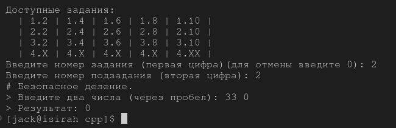

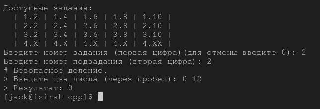

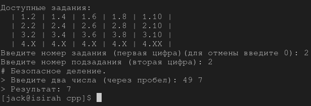

### 4. Строка сравнения.

#### Описание:

Дана сигнатура функции: String makeDecision (int x, int y);
Необходимо реализовать функцию таким образом, чтобы она возвращала
строку, которая включает два принятых функцией числа и корректно
выставленный знак операции сравнения (больше, меньше, или равно).

#### Алгоритм решения:

Если x и y равны, то возращаем ``"x == y"``.

Иначе если x больше y - ``"x > y"``.

    Иначе -``"x < y"``.

#### Код:

```
string makeDecision(int x, int y){ // 2 4
    string znak;
    if (x == y) znak = " == ";
    else
        if (x > y) znak = " > ";
        else znak = " < ";
    return (to_string(x) + znak + to_string(y));
}
```

#### Тестирование:

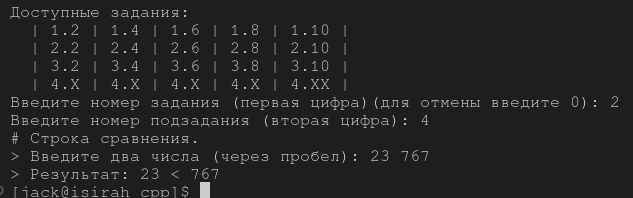

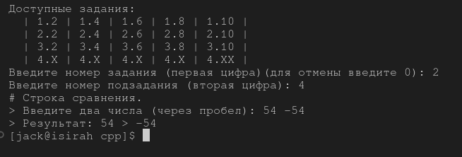

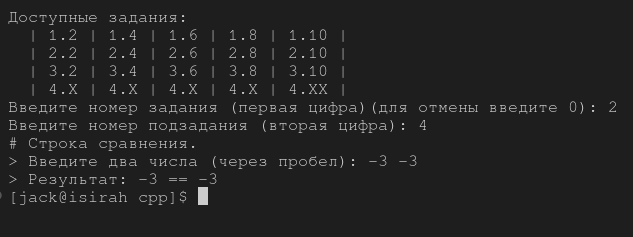

### 6. Тройная сумма.

#### Описание:

Дана сигнатура функции: bool sum3 (int x, int y, int z);
Необходимо реализовать функцию таким образом, чтобы она возвращала true,
если два любых числа (из трех принятых) можно сложить так, чтобы получить
третье.

#### Алгоритм решения:

Если:

* сумма x и y равна z;
* или сумма x и z равна y;
* или сумма y и z равна x;

 то возращаем ``true``.

Иначе - ``false``.

#### Код:

```
bool sum3(int x, int y, int z){ // 2 6
    return (x + y == z || x + z == y || y + z == x)? true : false;
}
```

#### Тестирование:

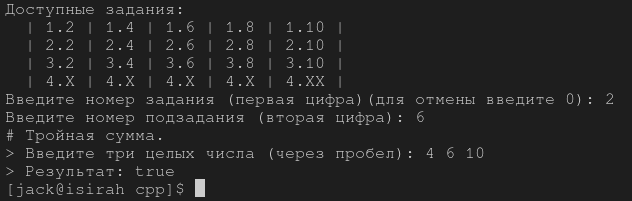

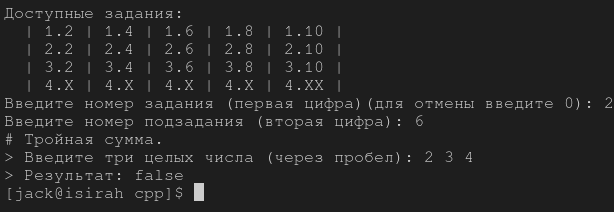


### 8.

#### Описание:

Дана сигнатура функции: String age (int x);
Необходимо реализовать функцию таким образом, чтобы она возвращала
строку, в которой сначала будет число х, а затем одно из слов:
• год
• года
• лет
Слово “год” добавляется, если число х заканчивается на 1, кроме числа 11.
Слово “года” добавляется, если число х заканчивается на 2, 3 или 4, кроме чисел
12, 13, 14.
Слово “лет”добавляется во всех остальных случаях.
Подсказка: оператор % позволяет получить остаток от деления.

#### Алгоритм решения:

Если остаток от деления числа **x** на 10 равен:

1. **1** и **x** не равен 11, то возращаем ``"год"``;
2. **2, 3, 4** и **x** не равен 12, 13 или 14, то возращаем ``"года"``;

Если варианты *1* или *2* не подходят, то возращаем ``"лет"``.

#### Код:

```
string age(int x){ // 2 8
    string year;
    switch (x % 10){  
        case 1:
            if (x == 11) year = "лет";
            else year = "год";
            break;

        case 2: case 3: case 4:
            if (x == 12 || x == 13 || x == 14) year = "лет";
            else year = "года";
            break;
  
        default:
            year = "лет";
            break;
    };
    return (to_string(x) + " " + year);
}
```

#### Тестирование:

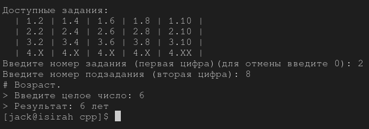

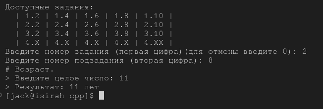

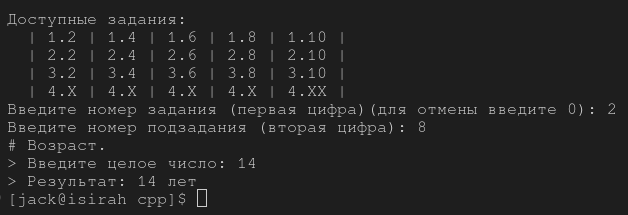

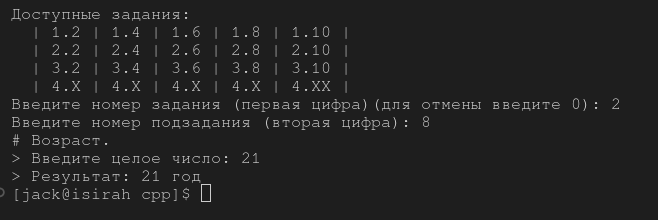

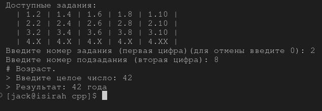

### 10. Вывод дней недели.

#### Описание:

Дана сигнатура функции: void printDays (int x);
В качестве параметра функция принимает число x, обозначаются день недели.
Необходимо реализовать функцию таким образом, чтобы она выводила на
экран название переданного в него дня и всех последующих до конца недели
дней. Если в качестве параметра передан не день (число, не в диапазоне от 1 от
7), то выводится текст “это не день недели”. Первый день понедельник,
последний – воскресенье. Вместо if в данной задаче используйте switch.

#### Алгоритм решения:

Если число **x** равен 1: выводим ``понедельник`` и следующие дни недели до воскресенья (включительно).

Если число **x** равен 2: выводим ``вторник`` и все остальные дни недели до воскресенья (включительно).

И т.д., пока x принадлежит {1,2,3,4,5,6,7} .

Иначе выводим ``это не день недели``.

#### Код:

```
void printDays(int x){ // 2 10
    switch (x)
    {
        case 1:
            cout << "\nпонедельник";
  
        case 2:
            cout << "\nвторник";

        case 3:
            cout << "\nсреда";

        case 4:
            cout << "\nчетверг";

        case 5:
            cout << "\nпятница";

        case 6:
            cout << "\nсуббота";

        case 7:
            cout << "\nвоскресенье";
            break;

        default:
            cout << "\nэто не день недели";
            break;
    }
}
```

#### Тестирование:

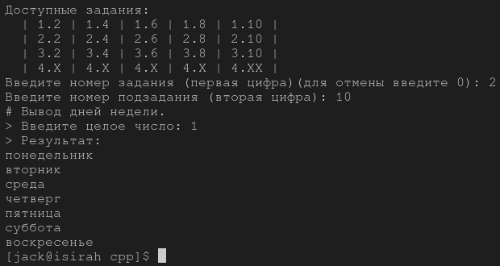

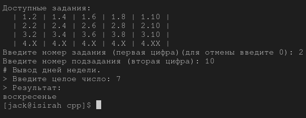

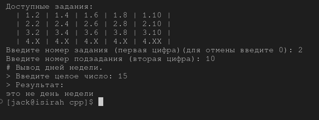

## Задание 3.

### 2. Числа наоборот.

#### Описание:

Дана сигнатура функции: String reverseListNums (int x);
Необходимо реализовать функцию таким образом, чтобы она возвращала
строку, в которой будут записаны все числа от x до 0 (включительно).

#### Алгоритм решения:

Если число x >= 0, то добавляем символы x-1, x-2, x-3 и т.д. до 0 в переменную строки.

Иначе добавляем симолы x+1, x+2, x+3 и т.д. до 0 в переменную строки.

Возращаем  полученную строку.

#### Код:

```
string reverseListNums(int x){ // 3 2
    string res = "";
    if (x >= 0){
        for (int i = x; i >= 0; i--){
            res.append(to_string(i));
            if (i > 0) res.append(" ");
            // res += i;
        };
    }
    else{
        for (int i = x; i <= 0; i++){
            res.append(to_string(i));
            if (i < 0) res.append(" ");
        };
    }
    return res;
}
```

#### Тестирование:

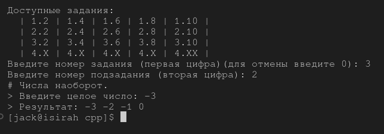

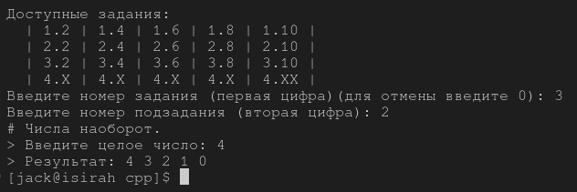

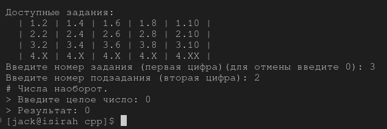

### 4. Степень числа.

#### Описание:

Дана сигнатура функции: int pow (int x, int y);
Необходимо реализовать функцию таким образом, чтобы она возвращала
результат возведения x в степень y.
Подсказка: для получения степени необходимо умножить единицу на число x,
и сделать это y раз, т.е. два в третьей степени это 1*2*2*2.

#### Алгоритм решения:

В цикле, пока y > 1, умножаем x на x; y уменьшаем на 1.

Возращаем ``x``.

#### Код:

```
int pow(int x, int y){ // 3 4
    for (; y > 1; y--){
        x *= x;
    }
    return x;
}
```

#### Тестирование:

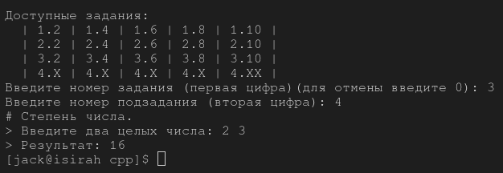

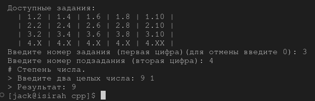

### 6. Одинаковость.

#### Описание:

Дана сигнатура функции: bool equalNum (int x);
Необходимо реализовать функцию таким образом, чтобы она возвращала true,
если все знаки числа одинаковы, и false в ином случае.
Подсказки:
intx=123%10; // х будет иметь значение 3
intу=123/10; // у будет иметь значение 12

#### Алгоритм решения:

Если число **x** отрицательно, то возращаем ``false``.

Запоминаем единичный символ **prevx**.

Пока **x** больше 0, а единичный символ **x** и символ **prevx** одинаковы, то:

* если единичный символ **x** и символ **prevx** НЕодинаковы, то возращаем ``false``;
* иначе:
  * **prevx** равен единичному символу **x;**
  * убираем у **x** единичный символ;

#### Код:

```
bool equalNum(int x){ // 3 6
    bool equal = true;
    int prevx = x % 10;
    if (x < 0)
        equal = false;
    while (x > 0 && equal){
        //equal = (x % 10 != prevx)? false: true;
        if (x % 10 != prevx) equal = false;
        prevx = x % 10;
        x /= 10;
    }
    return equal;
}
```

#### Тестирование:

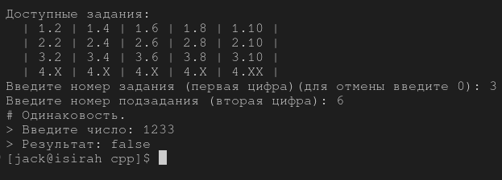

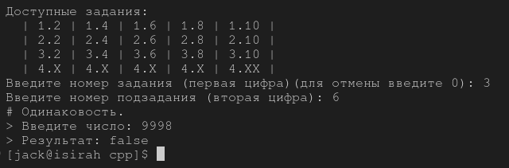

### 8. Левый треугольник.

#### Описание:

Дана сигнатура функции: void leftTriangle (int x);
Необходимо реализовать функцию таким образом, чтобы она выводила на
экран треугольник из символов ‘*’ у которого х символов в высоту, а количество
символов в ряду совпадает с номером строки.

#### Алгоритм решения:

Цикле"строк" вызываем **x** раз, где:

* цикл "столбцов" вызываем ***строка №*** раз, где:
  * выводим символ ``*``;
* выводим новую строку;

#### Код:

```
void leftTriangle(int x){ // 3 8
    for (int i = 1; i <= x; i++){
        for (int j = i; j > 0; j--){
            cout << '*';
        }
        cout << endl;
    }
}
```

#### Тестирование:

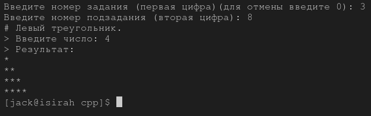

### 10. Угадайка.

#### Описание:

Дана сигнатура функции: void guessGame()
Необходимо реализовать функцию таким образом, чтобы она генерировала
случайное число от 0 до 9, далее считывала с консоли введенное пользователем
число и выводила, угадал ли пользователь то, что было загадано, или нет.
Функция запускается до тех пор, пока пользователь не угадает число. После
этого выведите на экран количество попыток, которое потребовалось
пользователю, чтобы угадать число.горитм решения:

Создаем рандомное число.

Если пользователь не угадал рандомное число, даем пользователю повторную попытку.

Иначе выводим количество попыток.

#### Код:

```
void guessGame(){ // 3 10
    srand(time(0));
    int luckyNum = rand() % 10;
    cout << "[DEBUG luckyNum = " << luckyNum << "]\n";
    int totalGuesses = 1;
    int userNum;

    cout << "Введите число от 0 до 9:\n";
    cin >> userNum;
    while (userNum != luckyNum){
        cout << "Вы не угадали, введите число от 0 до 9:\n";
        cin >> userNum;
        totalGuesses += 1;
    }
    cout << "Вы угадали!\n" << "Вы отгадали число за " << totalGuesses << " попыт(ку|ки|ок)\n";
}
```

#### Тестирование:

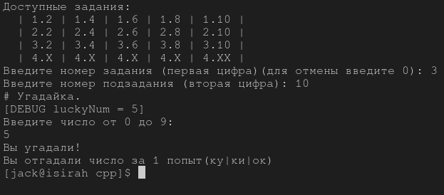

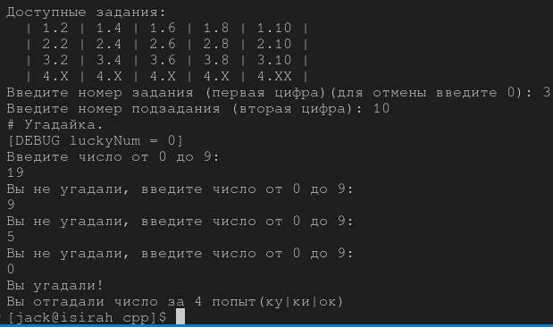

## Задание 4.

### 2.

#### Описание:

#### Алгоритм решения:

### 2.

#### Описание:

#### Алгоритм решения:

#### Код:

#### Тестирование:

### 2.

#### Описание:

#### Алгоритм решения:

#### Код:

#### Тестирование:

### 2.

#### Описание:

#### Алгоритм решения:

#### Код:

#### Тестирование:

### 2.

#### Описание:

#### Алгоритм решения:

#### Код:

#### Тестирование:
