# Репозиторий лабороторных работ по дисциплине "Язык программирования C++"

# Лаб. №4 ПЕРЕГРУЗКА ОПЕРАТОРОВ

# Вариант: 6

# Группа: ИТ-5-2024

# ФИО: Чугаев Евгений Игоревич

# Описание лабораторной работы:

В **задании 1** реализовать определение класса (поля, свойства, конструкторы (не менее трех),
перегрузку оператора вывода для вывода полей, заданный метод согласно варианту).
Протестировать все методы, включая конструкторы, все исходные данные вводятся с клавиатуры, не
забывайте проверять данные на корректность.


В **задании 2** добавить к реализованному в первом задании классу указанные в варианте
перегруженные операции.


В главной функции main показать работу всех функций с дружественным интерфейсом.
Необходимо решить задания согласно вашему варианту. Задание 1 оценивается в 3 балла, задание 2 -
5 баллов. Максимально за лабораторную работу можно получить 10 баллов (8 баллов за решение
задач + 2 балла за оформление отчета).

## Задание 1.

### 6. QuadraticEquation

#### Описание: [описание лаб.]

##### Название класса: QuadraticEquation

##### Поля:
    double a 
    double b 
    double c 
    (коэффициенты)

##### Методы
    Вычисление  корней  квадратного уравнения.  Результат  должен  быть массивом величин типа double (в нем от 0 до  2-х элементов,  в  зависимости  от количества корней).

#### Алгоритм решения:
    Инициализация программы:

        Подключаются необходимые библиотеки (iostream, vector, cmath).

        Объявляется класс QuadraticEquation с приватными полями a_, b_, c_ (коэффициенты уравнения).

    Реализация методов класса:

        Конструкторы:

            Конструктор по умолчанию инициализирует коэффициенты нулями.

            Конструктор копирования создаёт новый объект с такими же коэффициентами, как у переданного.

            Параметризованный конструктор принимает значения a, b, c и присваивает их полям объекта.

        Геттеры (get_a, get_b, get_c) возвращают значения соответствующих коэффициентов.

        Перегрузка оператора вывода (<<) форматирует вывод уравнения, обрабатывая особые случаи (нулевые/отрицательные коэффициенты).

        Метод roots():

            Создает пустой вектор для хранения корней.

            Если a = 0, проверяет является ли уравнение линейным:

                Если b ≠ 0, вычисляет один корень -c/b и добавляет в вектор.

                Если b = 0, возвращает пустой вектор (нет корней).

            Если a ≠ 0, вычисляет дискриминант D = b² - 4ac:

                При D > 0 вычисляет два корня и добавляет их в вектор.

                При D = 0 вычисляет один корень и добавляет в вектор.

                При D < 0 возвращает пустой вектор.

    Работа главного меню:

        Выводится приветствие и инструкция (ввод 99 для справки).

        Создаётся объект quadeq с нулевыми коэффициентами.

        Запускается цикл, который продолжается до ввода -1.

    Обработка пользовательского ввода:

        На каждой итерации цикла:

            Выводится текущее уравнение.

            Запрашивается номер команды.

            Если введено 99: вывод списка доступных команд (включая команду 2 для вычисления корней).

            Если введено 1:

                Запрашиваются новые значения a, b, c.

                Создаётся временный объект с введёнными коэффициентами и присваивается quadeq.

            Если введено 2:

                Вызывается метод roots() для текущего уравнения.

                Корни выводятся в формате: [ корень1 корень2 ... ].

                Если корней нет, выводится пустой массив [ ].

            Если введено -1: завершение цикла и программы.

            При неверном вводе: вывод ошибки, сброс состояния потока ввода.

    Логика вычисления корней:

        Линейный случай (a = 0): решается как линейное уравнение bx + c = 0.

        Квадратный случай (a ≠ 0): используется стандартная формула через дискриминант.

        Возвращается вектор, который может содержать 0, 1 или 2 элемента в зависимости от количества действительных корней.

    Завершение программы:
    После выхода из цикла программа корректно завершается.


#### Код:

```
#ifndef QUADRATICEQUATION
#define QUADRATICEQUATION

#include <iostream>
#include <vector>
#include <cmath>

class QuadraticEquation {
private:
    double a_, b_, c_;
public:
    QuadraticEquation();
    QuadraticEquation(const QuadraticEquation& quadeq);
    QuadraticEquation(double a, double b, double c);

    double get_a() const;
    double get_b() const;
    double get_c() const;

    friend std::ostream& operator<< (std::ostream& out, const QuadraticEquation& quadeq);

    std::vector<double> roots() const;
};


#endif

include "QuadraticEquation.h"

QuadraticEquation::QuadraticEquation(): a_(0), b_(0), c_(0) {}

QuadraticEquation::QuadraticEquation(const QuadraticEquation &quadeq) : a_(quadeq.a_), b_(quadeq.b_), c_(quadeq.c_) {}

QuadraticEquation::QuadraticEquation(double a, double b, double c) : a_(a), b_(b), c_(c) {}

double QuadraticEquation::get_a() const { return a_; }

double QuadraticEquation::get_b() const { return b_; }

double QuadraticEquation::get_c() const { return c_; }

std::ostream &operator<<(std::ostream &out, const QuadraticEquation &quadeq)
{
    out << "Квадратное уравнение: "; // << quadeq.a_ << " * x^2 + " << quadeq.b_ << " * x + " << quadeq.c_ << " = 0";
    if (not(quadeq.a_ || quadeq.b_ || quadeq.c_)) {
        out << "0";
        return out;
    }
    if (quadeq.a_) out << quadeq.a_ << "x^2";
    if (quadeq.b_ < 0) {
        out << " - " << -quadeq.b_ << "x";
    } else if (quadeq.b_ > 0) {
                out << " + " << quadeq.b_ << "x";
            }
    if (quadeq.c_ < 0) {
        out << " - " << -quadeq.c_;
    } else if (quadeq.c_ > 0) {
                out << " + " << quadeq.c_;
            }
    out << " = 0";

    return out;
}

std::vector<double> QuadraticEquation::roots() const
{
    std::vector<double> vRoots;
    
    // a = 0 -- уравнение линейное
    if (a_ == 0) {
        if (b_ != 0) {
            // только один корень
            vRoots.push_back(-c_ / b_);
        }
        // a = b = 0 -- нет корней
        return vRoots;
    }
    
    double d = b_ * b_ - 4 * a_ * c_;
    
    if (d > 0) {
        double sqrt_d = std::sqrt(d);
        vRoots.push_back((-b_ - sqrt_d) / (2 * a_));
        vRoots.push_back((-b_ + sqrt_d) / (2 * a_));
    } else if (d == 0) {
        vRoots.push_back(-b_ / (2 * a_));
    }
    // d < 0 -- нет корней

    return vRoots;
}

int main() {
    setlocale(LC_ALL, "");
    std::cout << "QuadraticEquation\nВычисление  корней  квадратного уравнения.\nРезультат  должен  быть массивом величин типа double (в нем от 0 до  2-х  элементов,  в  зависимости  от количества корней)." << std::endl;
    std::cout << "Введите \'99\' для справки." << std::endl;

    QuadraticEquation quadeq;
    bool userInput = true;

    while (userInput) {
        std::cout << "\n" << quadeq << std::endl;
        int userChoice = 0;
        std::cout << "Номер функции программы: ";
        std::cin >> userChoice;
        
        if (userChoice == -1) break;

        switch (userChoice) {
            case 99: {
                std::cout << "-1. Завершение работы программы." << std::endl; 
                std::cout << "== МЕТОДЫ [1-2] ==" << std::endl;
                std::cout << "1. Задать значения коэффициентам a, b, c (double)." << std::endl;
                std::cout << "2. Вычисление корней (массив величин типа double)." << std::endl;
                break;
            }
            // case -1: {
            //     userInput = false;
            //     break;
            // }
            case 1: {
                double a = 0, b = 0, c = 0;
                std::cout << "Введите a: ";
                std::cin >> a;
                std::cout << "Введите b: ";
                std::cin >> b;
                std::cout << "Введите c: ";
                std::cin >> c;

                QuadraticEquation temp = QuadraticEquation(a, b, c);
                quadeq = temp;

                break;
            }
            case 2: {
                std::cout << "Корни уравнения: [ ";
                std::vector vRoots = quadeq.roots();
                for (double root : vRoots) {
                    std::cout << root << " ";
                }
                std::cout << "]" << std::endl;
                break;
            }
            default: {
                std::cout << "Неверный ввод! Для справки введите \'99\'." << std::endl;
                std::cin.clear();
                std::cin.ignore(1000, '\n');
                break;
            }
        }
    }

    return 0;
}
```

#### Тестирование:
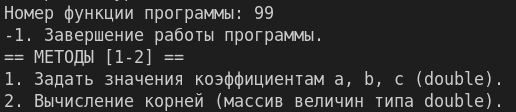
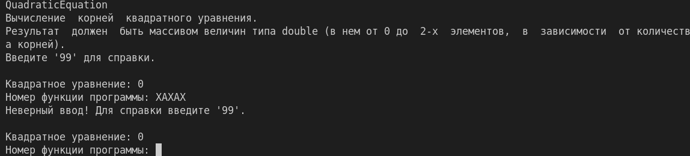
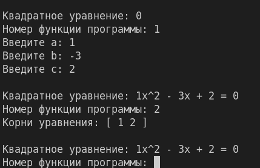
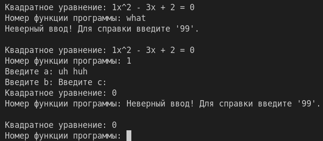
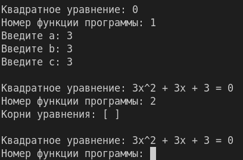
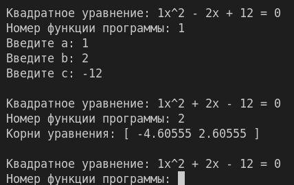
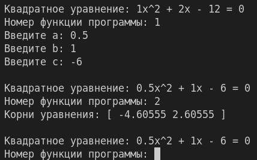

## Задание 2.

### 6. QuadraticEquation

#### Описание: [описание лаб.]

##### Название класса: QuadraticEquation

##### Методы
    Унарные операции: 
        ++ увеличивает коэффициенты уравнения на 1; 
        -- уменьшает коэффициенты уравнения на 1. 
    Операции приведения типа: 
        double (неявная) – результатом является дискриминант уравнения. 
        bool  (явная) –  результатом является true,  если корни существуют и falseв противном случае; 
    Бинарные операции 
        == QuadraticEquation t — уравнения равны, если равны их коэффициенты; 
        != QuadraticEquation t — уравнения  не  равны,  если  не  равны  их коэффициенты.

#### Алгоритм решения:
    Запуск программы:

        Программа начинает выполнение с функции main()

        Устанавливается русская локаль для корректного отображения текста

        Выводится приветственное сообщение о назначении программы

    Инициализация:

        Создается объект quadeq класса QuadraticEquation с нулевыми коэффициентами

        Устанавливается флаг userInput = true для управления основным циклом

    Основной цикл программы:

        Начало итерации:

            Выводится текущее состояние уравнения в удобочитаемом формате

            Программа запрашивает у пользователя номер команды

        Обработка команды завершения:

            Если пользователь ввел -1, цикл прерывается и программа завершает работу

        Обработка команд меню:

        Команда 99 (Справка):

            Выводится подробный список всех доступных команд с их описанием

        Команда 1 (Ввод коэффициентов):

            Программа запрашивает у пользователя три числа: a, b, c

            Создается временный объект с введенными коэффициентами

            Основной объект quadeq заменяется этим временным объектом

        Команда 2 (Вычисление корней):

            Вызывается метод roots(), который возвращает вектор корней

            Корни выводятся в формате массива в квадратных скобках

            Если корней нет, выводится пустой массив

        Команды 3-4 (Операции инкремента):

            Команда 3: применяется префиксный инкремент (++quadeq) - коэффициенты увеличиваются до вывода

            Команда 4: применяется постфиксный инкремент (quadeq++) - коэффициенты увеличиваются после вывода

        Команды 5-6 (Операции декремента):

            Команда 5: применяется префиксный декремент (--quadeq) - коэффициенты уменьшаются до вывода

            Команда 6: применяется постфиксный декремент (quadeq--) - коэффициенты уменьшаются после вывода

        Команда 7 (Приведение к double):

            Выполняется неявное приведение объекта к типу double

            Выводится значение дискриминанта уравнения

        Команда 8 (Приведение к bool):

            Выполняется явное приведение объекта к типу bool

            Выводится true, если уравнение имеет действительные корни, иначе false

        Команда 9 (Сравнение на равенство):

            Пользователь вводит коэффициенты второго уравнения

            Создается второй объект уравнения

            Сравниваются коэффициенты двух уравнений оператором ==

            Выводится результат сравнения

        Команда 10 (Сравнение на неравенство):

            Пользователь вводит коэффициенты второго уравнения

            Создается второй объект уравнения

            Сравниваются коэффициенты двух уравнений оператором !=

            Выводится результат сравнения

        Некорректный ввод:

            Если введена неизвестная команда, выводится сообщение об ошибке

            Очищается буфер ввода для корректной работы следующих итераций

    Завершение программы:

        При выходе из основного цикла программа возвращает 0

        Все ресурсы освобождаются автоматически

#### Код
```
// QuadraticEquation.h, ЧУЕ
// Description: lab4.h
#ifndef QUADRATICEQUATION
#define QUADRATICEQUATION

#include <iostream>
#include <vector>
#include <cmath>

class QuadraticEquation {
private:
    double a_, b_, c_;
public:
    QuadraticEquation();
    QuadraticEquation(const QuadraticEquation& quadeq);
    QuadraticEquation(double a, double b, double c);

    double get_a() const;
    double get_b() const;
    double get_c() const;

    friend std::ostream& operator<< (std::ostream& out, const QuadraticEquation& quadeq);

    std::vector<double> roots() const;

    QuadraticEquation& operator++();
    QuadraticEquation operator++(int);
    QuadraticEquation& operator--();
    QuadraticEquation operator--(int);

    operator double() const;
    explicit operator bool() const;
};
bool operator== (const QuadraticEquation& quadL, const QuadraticEquation& quadR);
bool operator!= (const QuadraticEquation& quadL, const QuadraticEquation& quadR);

#endif

// QuadraticEquation.cpp, ЧУЕ
// Description: lab4.h.cpp
#include "QuadraticEquation.h"

QuadraticEquation::QuadraticEquation(): a_(0), b_(0), c_(0) {}

QuadraticEquation::QuadraticEquation(const QuadraticEquation &quadeq) : a_(quadeq.a_), b_(quadeq.b_), c_(quadeq.c_) {}

QuadraticEquation::QuadraticEquation(double a, double b, double c) : a_(a), b_(b), c_(c) {}

double QuadraticEquation::get_a() const { return a_; }

double QuadraticEquation::get_b() const { return b_; }

double QuadraticEquation::get_c() const { return c_; }

std::vector<double> QuadraticEquation::roots() const
{
    std::vector<double> vRoots;
    
    // a = 0 -- уравнение линейное
    if (a_ == 0) {
        if (b_ != 0) {
            // только один корень
            vRoots.push_back(-c_ / b_);
        }
        // a = b = 0 -- нет корней
        return vRoots;
    }
    
    double d = b_ * b_ - 4 * a_ * c_;
    
    if (d > 0) {
        double sqrt_d = std::sqrt(d);
        vRoots.push_back((-b_ - sqrt_d) / (2 * a_));
        vRoots.push_back((-b_ + sqrt_d) / (2 * a_));
    } else if (d == 0) {
        vRoots.push_back(-b_ / (2 * a_));
    }
    // d < 0 -- нет корней

    return vRoots;
}

QuadraticEquation &QuadraticEquation::operator++()
{
    a_++;
    b_++;
    c_++;
    return *this;
}

QuadraticEquation QuadraticEquation::operator++(int)
{
    QuadraticEquation quadeq = *this;
    ++(*this);
    return quadeq;
}

QuadraticEquation &QuadraticEquation::operator--()
{
    a_--;
    b_--;
    c_--;
    return *this;
}

QuadraticEquation QuadraticEquation::operator--(int)
{
    QuadraticEquation quadeq = *this;
    --(*this);
    return quadeq;
}

QuadraticEquation::operator double() const
{
    double d = b_ * b_ - 4 * a_ * c_;
    return d;
}

QuadraticEquation::operator bool() const
{
    double d = b_ * b_ - 4 * a_ * c_;
    return (d >= 0 ? true : false); // bool(0.0) -- false !!!
}

std::ostream &operator<<(std::ostream &out, const QuadraticEquation &quadeq)
{
    out << "Квадратное уравнение: "; // << quadeq.a_ << " * x^2 + " << quadeq.b_ << " * x + " << quadeq.c_ << " = 0";
    if (not(quadeq.a_ || quadeq.b_ || quadeq.c_)) {
        out << "0";
        return out;
    }
    if (quadeq.a_) out << quadeq.a_ << "x^2";
    if (quadeq.b_ < 0) {
        out << " - " << -quadeq.b_ << "x";
    } else if (quadeq.b_ > 0) {
                out << " + " << quadeq.b_ << "x";
            }
    if (quadeq.c_ < 0) {
        out << " - " << -quadeq.c_;
    } else if (quadeq.c_ > 0) {
                out << " + " << quadeq.c_;
            }
    out << " = 0";

    return out;
}

bool operator==(const QuadraticEquation &quadL, const QuadraticEquation &quadR)
{
    if ((quadL.get_a() == quadR.get_a()) && (quadL.get_b() == quadR.get_b()) && (quadL.get_c() == quadR.get_c())) {
        return true;
    } else {
        return false;
    }
}

bool operator!=(const QuadraticEquation &quadL, const QuadraticEquation &quadR)
{
    if ((quadL.get_a() != quadR.get_a()) || (quadL.get_b() != quadR.get_b()) || (quadL.get_c() != quadR.get_c())) {
        return true;
    } else {
        return false;
    }
}

// main.cpp, ЧУЕ
// Description: lab4.cpp
#include "QuadraticEquation.h"
#include <iostream>

int main() {
    setlocale(LC_ALL, "");
    std::cout << "QuadraticEquation\nВычисление  корней  квадратного уравнения.\nРезультат  должен  быть массивом величин типа double (в нем от 0 до  2-х  элементов,  в  зависимости  от количества корней)." << std::endl;
    std::cout << "Введите \'99\' для справки." << std::endl;

    QuadraticEquation quadeq;
    bool userInput = true;

    while (userInput) {
        std::cout << "\n" << quadeq << std::endl;
        int userChoice = 0;
        std::cout << "Номер функции программы: ";
        std::cin >> userChoice;
        
        if (userChoice == -1) break;

        switch (userChoice) {
            case 99: {
                std::cout << "-1. Завершение работы программы." << std::endl; 
                std::cout << "== МЕТОДЫ [1-2] ==" << std::endl;
                std::cout << "1. Задать значения коэффициентам a, b, c (double)." << std::endl;
                std::cout << "2. Вычисление корней (массив величин типа double)." << std::endl;
                std::cout << "== УНАРНЫЕ ОПЕРАЦИИ [3-6] ==" << std::endl;
                std::cout << "3. Увеличить коэффициенты уравнения на 1 (префикс)." << std::endl;
                std::cout << "4. Увеличить коэффициенты уравнения на 1 (постфикс)." << std::endl;
                std::cout << "5. Уменьшить коэффициенты уравнения на 1 (префикс)." << std::endl;
                std::cout << "6. Уменьшить коэффициенты уравнения на 1 (постфикс)." << std::endl;
                std::cout << "== ОПЕРАЦИИ ПРИВИДЕНИЯ ТИПА [7-8] ==" << std::endl;
                std::cout << "7. Приведение к double (неявному виду) дискриминант уравнения." << std::endl;
                std::cout << "8. Приведение к bool (явному виду) существование корней." << std::endl;
                std::cout << "== БИНАРНЫЕ ОПЕРАЦИИ [9-10] ==" << std::endl;
                std::cout << "9. Уравнения равны, если равны их коэффициенты (QE == QE)." << std::endl;
                std::cout << "10. Уравнения НЕ равны, если НЕ равны их коэффициенты (QE != QE)." << std::endl;
                break;
            }
            // case -1: {
            //     userInput = false;
            //     break;
            // }
            case 1: {
                double a = 0, b = 0, c = 0;
                std::cout << "Введите a: ";
                std::cin >> a;
                std::cout << "Введите b: ";
                std::cin >> b;
                std::cout << "Введите c: ";
                std::cin >> c;

                QuadraticEquation temp = QuadraticEquation(a, b, c);
                quadeq = temp;

                break;
            }
            case 2: {
                std::cout << "Корни уравнения: [ ";
                std::vector vRoots = quadeq.roots();
                for (double root : vRoots) {
                    std::cout << root << " ";
                }
                std::cout << "]" << std::endl;
                break;
            }
            case 3: {
                std::cout << ++quadeq << std::endl;
                break;
            }
            case 4: {
                std::cout << quadeq++ << std::endl;
                break;
            }
            case 5: {
                std::cout << --quadeq << std::endl;
                break;
            }
            case 6: {
                std::cout << quadeq-- << std::endl;
                break;
            }
            case 7: {
                std::cout << "Приведение к double (неявному виду) дискриминант уравнения: " << double(quadeq);
                std::cout << std::endl;
                break;
            }
            case 8:{
                std::cout << "Приведение к bool (явному виду) существование корней: " << std::boolalpha << (bool)quadeq << std::endl;
                break;
            }
            case 9: {
                std::cout << "Введите коэффициенты нового уравнения: " << std::endl;
                double a = 0, b = 0, c = 0;
                std::cout << "Введите a: ";
                std::cin >> a;
                std::cout << "Введите b: ";
                std::cin >> b;
                std::cout << "Введите c: ";
                std::cin >> c;
                QuadraticEquation quadeqSecond = QuadraticEquation(a, b, c);
                std::cout << quadeqSecond << std::endl;
                std::cout << "Уравнения равны? " << std::boolalpha << (quadeq == quadeqSecond) << std::endl;
                break;
            }
            case 10: {
                std::cout << "Введите коэффициенты нового уравнения: " << std::endl;
                double a = 0, b = 0, c = 0;
                std::cout << "Введите a: ";
                std::cin >> a;
                std::cout << "Введите b: ";
                std::cin >> b;
                std::cout << "Введите c: ";
                std::cin >> c;
                QuadraticEquation quadeqSecond = QuadraticEquation(a, b, c);
                std::cout << quadeqSecond << std::endl;
                std::cout << "Уравнения НЕ равны? " << std::boolalpha << (quadeq != quadeqSecond) << std::endl;
                break;
            }
            default: {
                std::cout << "Неверный ввод! Для справки введите \'99\'." << std::endl;
                std::cin.clear();
                std::cin.ignore(1000, '\n');
                break;
            }
        }
    }

    return 0;
}
```
#### Тестирование
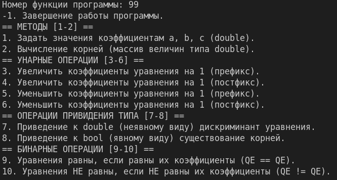

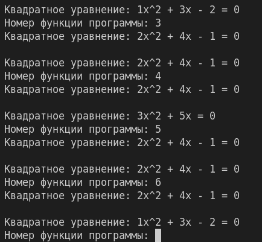
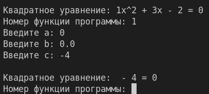
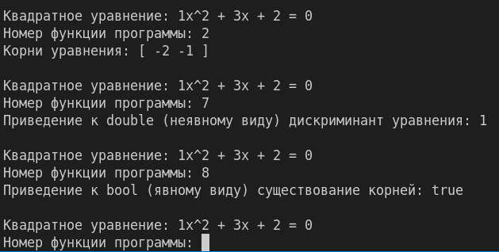
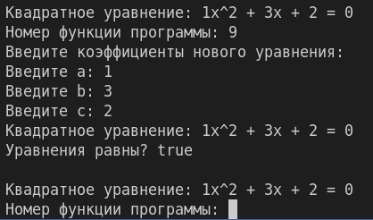
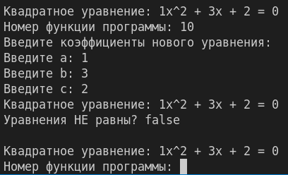