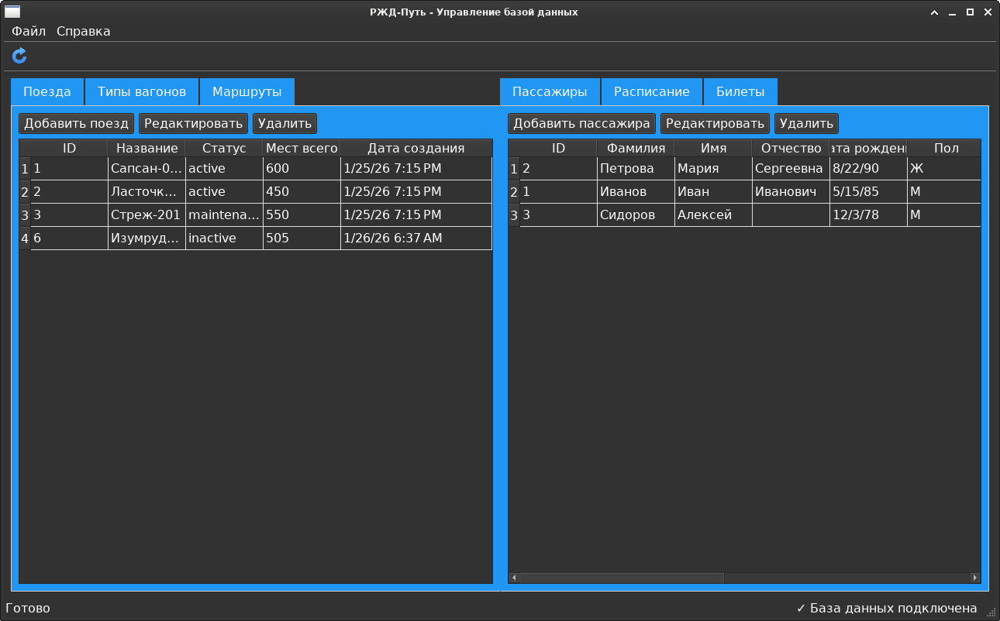

# Репозиторий лабороторных работ по дисциплине "Язык программирования C++"

# ИКМ

# Группа: ИТ-5-2024

# ФИО: Чугаев Евгений Игоревич

# Описание ИКМ:

Необходимо разработать приложение с использованием фреймворка QT и базы данных,
разработанной по дисциплине Базы данных и СУБД. Программа должна иметь интуитивно-понятный
дружественный интерфейс и проверку вводимых значений. В программе должны присутствовать
классы.
Необходимо реализовать функции:
• просмотр данных из базы;
• редактирование данных в базе;
• удаление данных из базы;
• добавление данных в базу.
Функции должны быть доступны для каждой таблицы.
База данных должна содержать минимум 3 связные таблицы.
К проекту должна быть написана xml-документация (отсутствие документации -5 баллов).
К данной работе писать отчет НЕ нужно. В качестве ответа прикрепить ссылку на github.
Максимально за лабораторную работу можно получить 20 баллов. Для получения минимального
количества баллов (10 баллов) должно быть реализовано 2 функции (одна из которых просмотр) и
база данных может содержать 2 таблицы.

# Реализация:

## Фреймворк:

QT Create

## СУБД:

Postgresql

# Алгоритм работы программы

## Общая архитектура

Программа использует паттерн Model-View-Controller (MVC):

1. Модели (Model) - классы, наследующие от QSqlTableModel и QSqlQueryModel
2. Представление (View) - QTableView, QTabWidget, диалоговые окна
3. Контроллер (Controller) - класс MainWindow, обрабатывающий пользовательские действия

## Последовательность работы программы

### 1. Запуск приложения (main.cpp)

1. Создание QApplication
2. Установка стиля Fusion
3. Проверка подключения к БД (Database::testConnection())
4. Если подключение успешно:
   - Создание MainWindow
   - Отображение главного окна
5. Запуск главного цикла приложения (app.exec())

### 2. Инициализация главного окна (MainWindow)

1. Создание объекта Database
2. Подключение к БД (m_database->connectToDatabase())
3. Создание всех моделей данных:
   - TrainModel, WagonTypeModel, RouteModel
   - PassengerModel, ScheduleModel, TicketModel
   - ScheduleViewModel, TicketViewModel
4. Настройка UI (setupUI())
5. Настройка меню и тулбара
6. Настройка статусбара
7. Установка соединений (setupConnections())
8. Обновление всех таблиц (refreshAllTables())

### 3. Структура вкладок

**Основные операции (m_mainTabWidget)**:

- Поезда
- Типы вагонов
- Маршруты

**Отчеты (m_reportsTabWidget)**:

- Пассажиры
- Расписание
- Билеты

### 4. Алгоритм добавления новой записи (на примере поезда)

1. Пользователь нажимает "Добавить поезд"
2. Вызывается MainWindow::addTrain()
3. Создается AddTrainDialog
4. Пользователь заполняет поля в диалоге
5. При нажатии "Добавить":
   - Выполняется валидация данных
   - Вызывается TrainModel::addTrain()
   - Метод выполняет SQL INSERT запрос
   - При успехе: модель обновляется (select())
   - Таблица автоматически обновляется

### 5. Взаимодействие с базой данных

MainWindow → Модель → Database → PostgreSQL

**Классы-модели**:

- TrainModel - работа с таблицей trains
- WagonTypeModel - работа с таблицей wagon_types
- RouteModel - работа с таблицей routes
- PassengerModel - работа с таблицей passengers
- ScheduleModel - работа с таблицей schedule
- TicketModel - работа с таблицей tickets

**Специальные модели для представлений**:

- ScheduleViewModel - JOIN запросы для расписания
- TicketViewModel - JOIN запросы для билетов

### 6. Алгоритм редактирования записи

1. Пользователь выбирает строку в таблице
2. Нажимает "Редактировать"
3. Вызывается соответствующий метод (editTrain(), editWagonType(), и т.д.)
4. Создается диалог с передачей ID записи
5. Диалог загружает текущие данные
6. Пользователь изменяет данные
7. При сохранении вызывается метод updateXXX() модели
8. Выполняется SQL UPDATE запрос
9. Таблица обновляется

### 7. Алгоритм удаления записи

1. Пользователь выбирает строку
2. Нажимает "Удалить"
3. Показывается диалог подтверждения
4. При подтверждении вызывается метод removeXXX() модели
5. Выполняется SQL DELETE запрос
6. Таблица обновляется

### 8. Обновление данных

MainWindow::refreshAllTables() {

1. Для каждой модели вызывается select()
2. Для ViewModel вызывается refresh()
3. Обновляется статус в статусбаре
   }

### 9. Диалоговые окна

Каждая сущность имеет свой диалог:

- AddTrainDialog - добавление/редактирование поездов
- AddWagonTypeDialog - типы вагонов
- AddRouteDialog - маршруты
- AddPassengerDialog - пассажиры
- AddScheduleDialog - расписание
- AddTicketDialog - билеты

### 10. Валидация данных

Каждый диалог имеет:

1. Проверку обязательных полей
2. Валидацию форматов (email, телефон, даты)
3. Проверку бизнес-логики (например, дата прибытия позже отправления)

### 11. Триггеры и ограничения в БД

База данных включает:

- Триггер для генерации номеров билетов
- Триггер для обновления свободных мест
- Ограничения целостности (FOREIGN KEY)
- Представления для сложных запросов

### 12. Обработка ошибок

1. Проверка подключения при запуске
2. Проверка выполнения SQL запросов
3. Валидация пользовательского ввода
4. Отображение сообщений об ошибках через QMessageBox
