# Репозиторий лабороторных работ по дисциплине "Язык программирования C++"

# Лаб. №5 ФАЙЛЫ

# Вариант: 6

# Группа: ИТ-5-2024

# ФИО: Чугаев Евгений Игоревич

# Описание лабораторной работы:

Выполнить все задания в одном проекте в виде **статических методов одного класса**.
**В задании 1 и 2** бинарные файлы, содержат числовые данные, исходный файл необходимо заполнить
случайными данными, заполнение организовать отдельным методом.
**В задании 3** бинарные файлы содержат величины типа struct, заполнение исходного файла
необходимо организовать отдельным методом.
**В задании 4** в текстовом файле хранятся целые числа по одному в строке, исходный файл
необходимо заполнить случайными данными, заполнение организовать отдельным методом.
**В задании 5** в текстовом файле хранятся целые числа по несколько в строке, исходный файл
необходимо заполнить случайными данными, заполнение организовать отдельным методом.
**В задании 6** в текстовом файле хранится текст.
Необходимо решить по 1 задаче из каждого задания согласно вашему варианту. Задания 1 и 4
оцениваются по 1 баллу, задания 2, 3, 5, 6 по 1,5 балла. Максимально за лабораторную работу можно
получить 10 баллов (8 баллов за решение задач + 2 балла за оформление отчета).

## Задание 1. Бинарные файлы

### 6.

#### Описание:

Переписать в другой файл последовательного доступа те элементы, которые кратны k.

#### Алгоритм решения:

**Шаг 1: Подготовка данных**

* Программа генерирует 20 случайных целых чисел от 1 до 100
* Эти числа записываются в бинарный файл "primary.bin" в виде последовательности байтов
* Сгенерированные числа одновременно выводятся на экран для наглядности

**Шаг 2: Получение параметра фильтрации**

* Пользователь вводит целое число k (не равное 0)
* Проверяется корректность ввода (не буквы, не нуль)
* При неверном вводе программа просит повторить

**Шаг 3: Фильтрация чисел**

* Открывается исходный файл "primary.bin" для чтения
* Создается (или полностью перезаписывается) выходной файл "1.6.bin"
* Программа читает числа одно за другим из исходного файла
* Для каждого числа проверяется условие: делится ли оно на k без остатка
* Числа, удовлетворяющие условию, записываются в выходной файл
* Одновременно отфильтрованные числа выводятся на экран
* После обработки всех чисел файлы закрываются

**Шаг 4: Вывод результата**

* Открывается выходной файл "1.6.bin" для чтения
* Считываются все числа из файла
* Числа выводятся на экран в том же порядке, в котором были записаны
* Проверяется, что выходной файл содержит только актуальные данные (старые значения удалены)

**Ключевые особенности алгоритма:**

1. Работа с бинарными файлами (не текстовыми)
2. Чтение и запись байт напрямую, без преобразования в строки
3. Использование флагов для гарантии перезаписи файла (не дописывания)
4. Последовательная обработка чисел без загрузки всего файла в память
5. Промежуточный вывод на экран для визуального контроля

#### Тестирование:

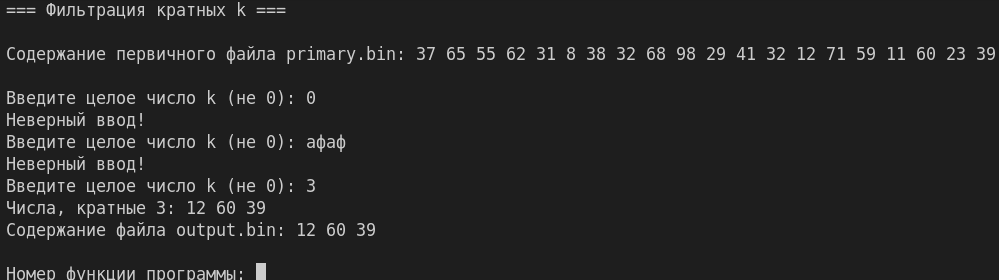

## Задание 2. Бинарные файлы

### 6.

#### Описание:

Скопировать элементы заданного файла в квадратную матрицу размером n×n (если элементов
файла недостает, заполнить оставшиеся элементы матрицы нулями). Заменить все столбцы на
столбец с минимальной суммой элементов.

#### Алгоритм решения:

**Шаг 1: Подготовка исходных данных**

* Генерируется 20 случайных целых чисел от 1 до 100
* Числа записываются в бинарный файл "primary.bin" в виде последовательности 4-байтовых значений
* Сгенерированные числа выводятся на экран для визуального контроля

**Шаг 2: Чтение исходных данных**

* Открывается бинарный файл "primary.bin" для чтения
* Все числа последовательно считываются из файла и помещаются в одномерный массив (вектор)

**Шаг 3: Ввод параметров матрицы**

* Пользователь вводит целое положительное число n (размер квадратной матрицы n×n)
* Проверяется корректность ввода (положительное число)

**Шаг 4: Формирование исходной матрицы**

* Создается квадратная матрица размером n×n
* Числа из одномерного массива последовательно размещаются в матрице построчно:
  * Первое число → позиция (0,0)
  * Второе число → позиция (0,1)
  * И так далее до конца строки, затем следующая строка
* Если чисел недостаточно для заполнения всей матрицы, оставшиеся ячейки заполняются нулями
* Полученная матрица выводится на экран в табличном виде

**Шаг 5: Анализ столбцов матрицы**

* Для каждого столбца матрицы вычисляется сумма всех элементов в этом столбце
* Суммы по столбцам выводятся на экран с указанием номера столбца
* Определяется столбец с минимальной суммой (если несколько столбцов с одинаковой минимальной суммой, берется первый)

**Шаг 6: Формирование результирующей матрицы**

* Создается новая квадратная матрица того же размера n×n
* Каждый столбец новой матрицы заполняется элементами из найденного столбца с минимальной суммой
* То есть все столбцы новой матрицы становятся одинаковыми и равны найденному столбцу
* Результирующая матрица выводится на экран

**Шаг 7: Сохранение результата**

* Создается (или перезаписывается) бинарный файл "output.bin"
* Элементы результирующей матрицы записываются в файл построчно:
  * Сначала все элементы первой строки
  * Затем все элементы второй строки
  * И так далее до последней строки
* Каждый элемент записывается как 4-байтовое целое число
* Файл закрывается

**Шаг 8: Проверка записи**

* Открывается файл "output.bin" для чтения
* Все числа считываются из файла и выводятся на экран
* Это позволяет убедиться, что данные записаны корректно

#### Тестирование:

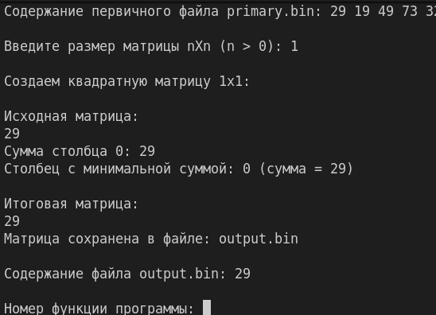

## Задание 3. Бинарные файлы и структуры

### 6.

#### Описание:

Файл содержит сведения об игрушках: название игрушки, ее стоимость в рублях и возрастные
границы (например, игрушка может предназначаться для детей от двух до пяти лет).Определить
стоимость самого дорогого конструктора.

#### Алгоритм решения:

**Шаг 1: Генерация бинарного файла с игрушками**

* Создается структура данных `Toy`, содержащая три поля:
  * название игрушки (массив из 50 символов)
  * цена (вещественное число типа `double`)
  * минимальный возраст (целое число)
* Создается (или перезаписывается) бинарный файл "toys.bin"
* Генерируется 15 записей об игрушках со случайными данными:
  * Название выбирается случайным образом из заданного списка, включающего различные типы игрушек
  * Цена генерируется случайно в диапазоне от 100.0 до 5000.0 рублей
  * Минимальный возраст генерируется случайно от 0 до 6 лет
* Каждая созданная запись записывается в бинарный файл
* Одновременно данные каждой игрушки выводятся на экран

**Шаг 2: Вывод содержимого файла с игрушками**

* Открывается бинарный файл "toys.bin" для чтения
* Последовательно считываются все записи структур `Toy` из файла
* Для каждой игрушки выводятся на экран:
  * порядковый номер игрушки
  * название
  * стоимость в рублях
  * минимальный возраст
* Файл закрывается после чтения всех записей

**Шаг 3: Поиск самого дорогого конструктора**

* Открывается бинарный файл "toys.bin" для чтения
* Последовательно считываются все записи об игрушках
* Для каждой игрушки проверяется, является ли она конструктором:
  * Название игрушки приводится к нижнему регистру (для регистронезависимого поиска)
  * В названии ищется подстрока "конструктор"
* Если игрушка является конструктором:
  * Ее данные выводятся на экран
  * Увеличивается счетчик найденных конструкторов
  * Сравнивается цена с текущей максимальной ценой
  * Если цена выше, запоминаются данные этого конструктора как самого дорогого
* После обработки всех игрушек анализируются результаты:
  * Если конструкторы не найдены, выводится соответствующее сообщение
  * Если конструкторы найдены, выводятся:
    * общее количество найденных конструкторов
    * данные самого дорогого конструктора (название, цена, минимальный возраст)

#### Тестирование:

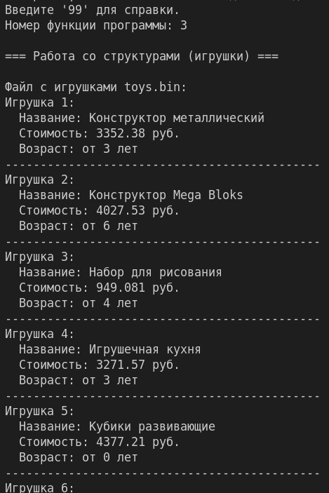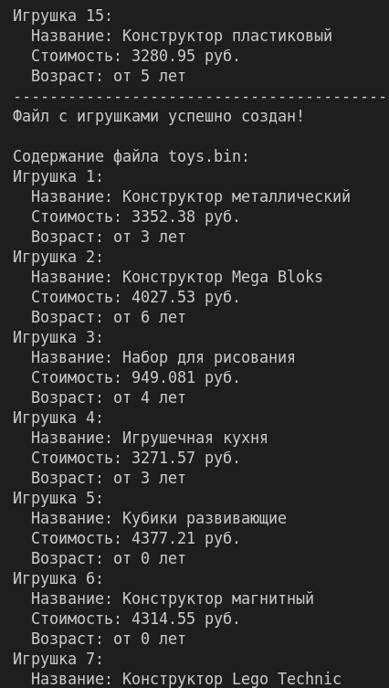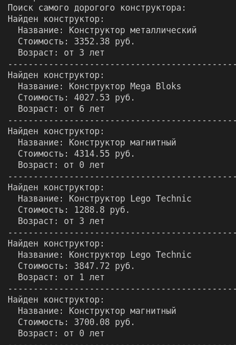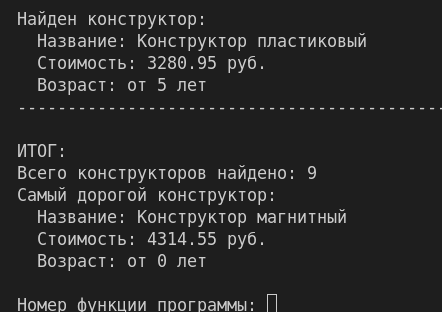

## Задание 4. Текстовые файлы

### 6.

#### Описание:

Найти сумму тех элементов файла, которые равны своему индексу (индексацию элементов файла
в этой задаче начинать с нуля).

#### Алгоритм решения:

**Шаг 1: Генерация текстового файла с числами**

* Создается (или перезаписывается) текстовый файл "numbers.txt"
* Генерируется 25 случайных целых чисел в диапазоне от 0 до 50
* Каждое число записывается в файл в отдельной строке (один элемент — одна строка)
* Одновременно для каждого числа выводится на экран:
  * значение числа
  * его индекс (позиция в файле, начиная с 0)
* Файл закрывается

**Шаг 2: Чтение и вывод содержимого файла**

* Открывается текстовый файл "numbers.txt" для чтения
* Построчно считываются все строки из файла
* Для каждой строки выводится на экран:
  * индекс строки (начиная с 0)
  * значение, содержащееся в этой строке
* Форматированный вывод представляет собой таблицу: индекс | значение
* Файл закрывается

**Шаг 3: Поиск и суммирование элементов, равных своему индексу**

* Открывается текстовый файл "numbers.txt" для чтения
* Инициализируются:
  * текущий индекс (начинается с 0)
  * сумма найденных элементов (изначально 0)
  * список индексов совпавших элементов
  * список значений совпавших элементов
* Для каждой строки в файле выполняется:
  * Строка проверяется на пустоту (игнорируются пустые строки)
  * Содержимое строки преобразуется в целое число
  * Если преобразование невозможно (некорректный формат), выводится сообщение об ошибке
  * Если число равно текущему индексу:
    * Выводится сообщение о совпадении (индекс и значение)
    * Число добавляется к общей сумме
    * Индекс сохраняется в список индексов совпадений
    * Значение сохраняется в список значений совпадений
  * Индекс увеличивается на 1 для следующей строки
* После обработки всех строк файл закрывается

**Шаг 4: Вывод результатов анализа**

* Проверяется, были ли найдены совпадения:
  * Если список совпадений пуст: выводится сообщение "Элементы, равные своему индексу, не найдены"
  * Если совпадения найдены:
    * Выводится количество найденных совпадений
    * Выводится список пар "индекс = значение" для каждого совпадения
    * Выводится итоговая сумма всех найденных элементов
* Результаты форматируются для удобного восприятия

#### Тестирование:

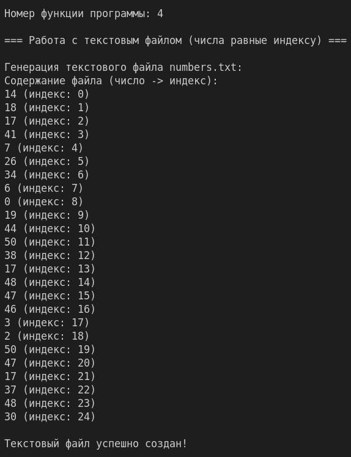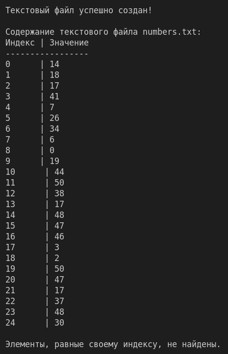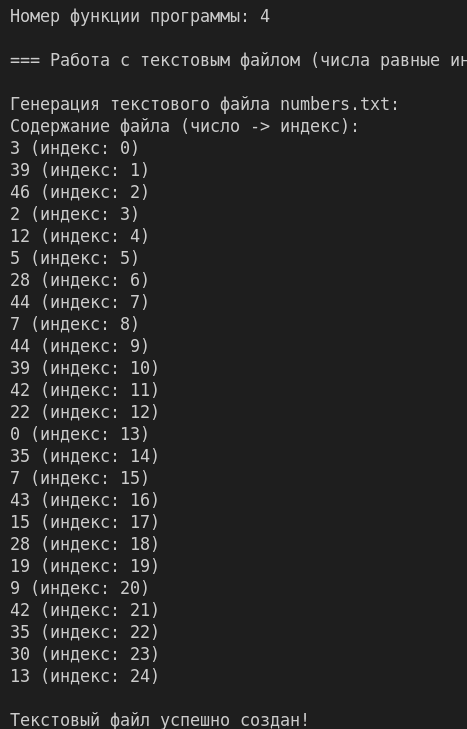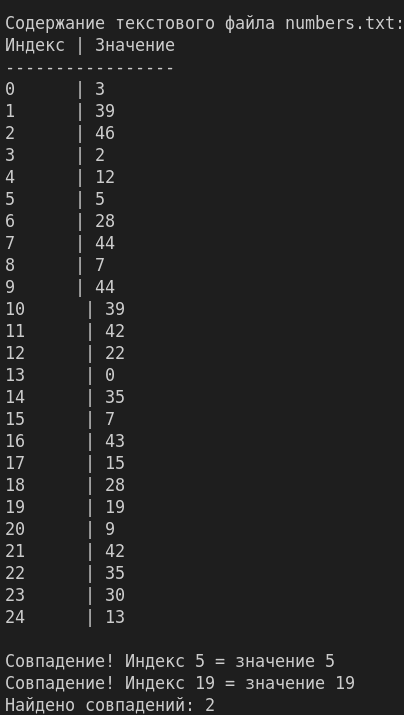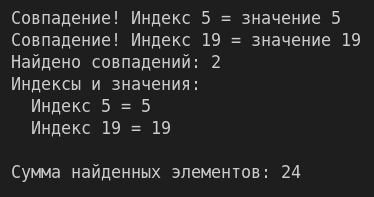

## Задание 5. Текстовые файлы

### 6.

#### Описание:

Вычислить произведение элементов, которые кратны заданному числу k.

#### Алгоритм решения:

**Шаг 1: Генерация текстового файла с несколькими числами в строке**

* Создается (или перезаписывается) текстовый файл "multi_numbers.txt"
* Определяется общее количество чисел для генерации (30 чисел)
* Устанавливается диапазон случайных чисел от 1 до 100
* Генерация происходит построчно с переменным количеством чисел в каждой строке:
  * В каждой строке генерируется от 2 до 5 чисел (случайное количество)
  * Если оставшееся количество чисел меньше максимального, генерируется столько, сколько осталось
* Каждое число записывается в строку через пробел
* После записи всех чисел в строку добавляется символ переноса строки
* Одновременно с записью в файл каждая строка выводится на экран с указанием номера строки
* Файл закрывается после генерации всех 30 чисел

**Шаг 2: Чтение и вывод содержимого файла**

* Открывается текстовый файл "multi_numbers.txt" для чтения
* Построчно считываются все строки из файла
* Для каждой непустой строки выводится на экран:
  * номер строки (начиная с 1)
  * содержимое строки (все числа через пробел)
* Форматированный вывод представляет собой таблицу: номер строки | содержимое
* Файл закрывается

**Шаг 3: Ввод параметра для фильтрации**

* Пользователь вводит целое число k (не равное 0)
* Проверяется корректность ввода (целое число, не ноль)
* При неверном вводе программа просит повторить ввод

**Шаг 4: Поиск и перемножение элементов, кратных k**

* Открывается текстовый файл "multi_numbers.txt" для чтения
* Инициализируются:
  * произведение найденных элементов (изначально 1)
  * счетчик найденных элементов (изначально 0)
  * список найденных чисел
* Построчно обрабатывается файл:
  * Для каждой строки определяется ее номер
  * Строка разбивается на отдельные числа с помощью строкового потока
  * Каждое число проверяется на кратность k (остаток от деления на k равен 0)
  * Если число кратно k:
    * Выводится сообщение о найденном числе с указанием номера строки
    * Число добавляется к произведению
    * Счетчик найденных элементов увеличивается на 1
    * Число сохраняется в список найденных чисел
* После обработки всех строк файл закрывается

**Шаг 5: Вывод результатов анализа**

* Проверяется, были ли найдены числа, кратные k:
  * Если счетчик найденных элементов равен 0: выводится сообщение, что чисел не найдено
  * Если числа найдены:
    * Выводится количество найденных чисел
    * Выводится список всех найденных чисел через запятую
    * Выводится произведение всех найденных чисел
* Результаты форматируются для удобного восприятия

#### Тестирование:

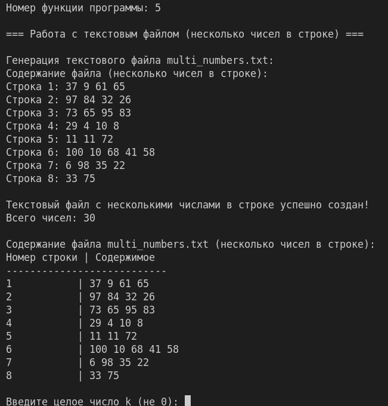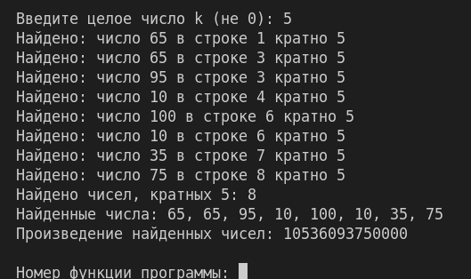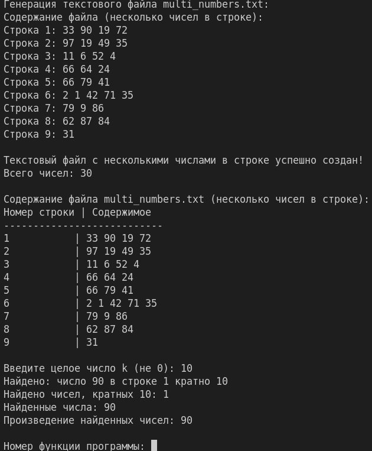

## Задание 6. Текстовые файлы

### 6.

#### Описание:

Переписать в другой файл строки, в которых нет русских букв.

#### Алгоритм решения:

**Шаг 1: Генерация многоязычного текстового файла**

* Создается (или перезаписывается) текстовый файл "text_file.txt"
* Генерируется 20 строк текста, содержащих различные комбинации:
  * Строки только на английском языке (без русских букв)
  * Строки только на русском языке
  * Смешанные строки (содержащие и русские, и английские слова)
  * Строки с цифрами и специальными символами
* Каждая строка записывается в файл с переносом на новую строку
* Одновременно все сгенерированные строки выводятся на экран с указанием номера строки

**Шаг 2: Вывод содержимого исходного файла**

* Открывается текстовый файл "text_file.txt" для чтения
* Построчно считываются все строки из файла
* Для каждой непустой строки выводится на экран:
  * номер строки (начиная с 1)
  * полное содержимое строки
* Форматированный вывод представляет собой таблицу: номер строки | содержимое
* Файл закрывается

**Шаг 3: Определение наличия русских букв в строке**

* Создается функция-помощник, которая проверяет, содержит ли строка русские буквы
* Функция работает по следующему алгоритму:
  * Создается строка, содержащая все русские буквы в обоих регистрах (включая букву "ё")
  * Для каждого символа в проверяемой строке:
    * Проверяется, содержится ли этот символ в строке русских букв
    * Если хотя бы один символ является русской буквой, функция возвращает `true`
  * Если ни один символ не является русской буквой, функция возвращает `false`

**Шаг 4: Фильтрация строк без русских букв**

* Открывается исходный файл "text_file.txt" для чтения
* Создается (или перезаписывается) новый текстовый файл "no_russian.txt" для записи
* Инициализируется счетчик записанных строк (изначально 0)
* Построчно обрабатывается исходный файл:
  * Для каждой строки определяется ее номер
  * Вызывается функция проверки наличия русских букв
  * Если строка НЕ содержит русских букв:
    * Она записывается в новый файл "no_russian.txt"
    * Счетчик записанных строк увеличивается на 1
    * На экран выводится сообщение, что строка записана (не содержит русских букв)
  * Если строка содержит русские буквы:
    * На экран выводится сообщение, что строка пропущена
* После обработки всех строк оба файла закрываются

**Шаг 5: Вывод результатов фильтрации**

* Открывается результирующий файл "no_russian.txt" для чтения
* Выводится информация о результате фильтрации:
  * Имя созданного файла
  * Количество строк, записанных в новый файл
* Построчно считываются и выводятся на экран все строки из результирующего файла
* Если файл пуст, выводится соответствующее сообщение
* Файл закрывается

#### Тестирование:

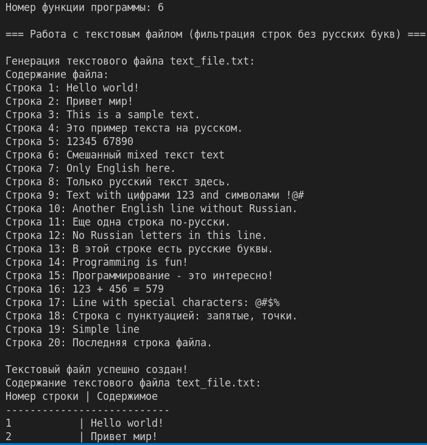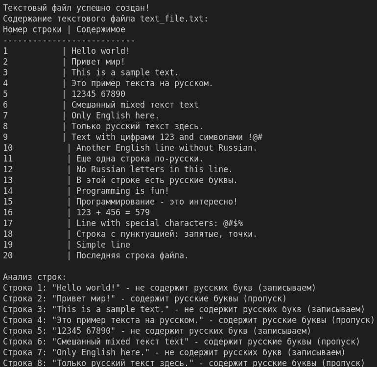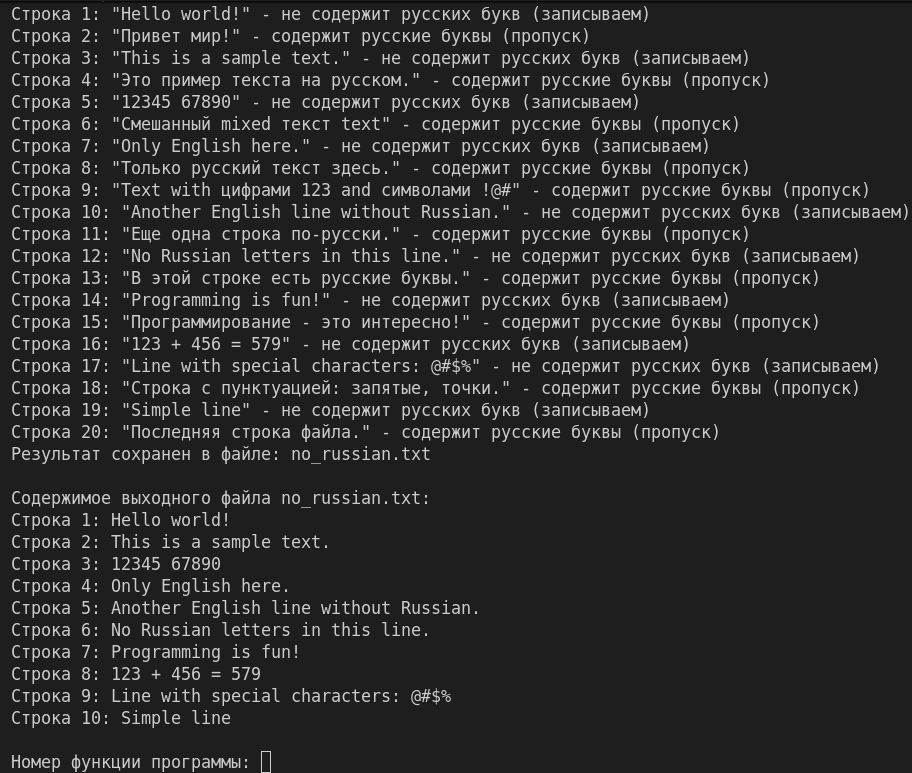
