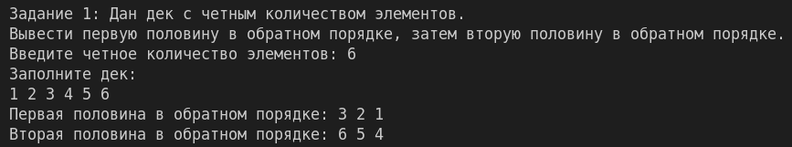
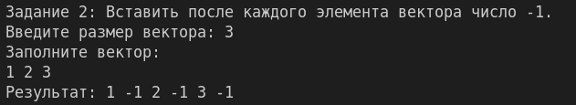
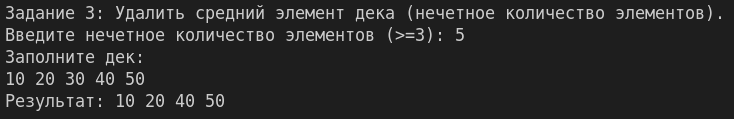
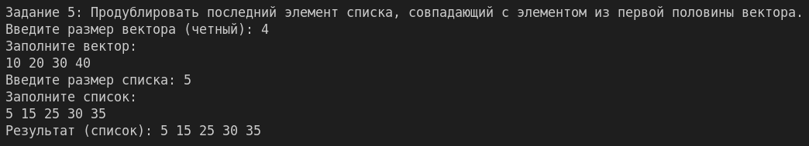
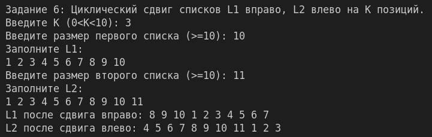
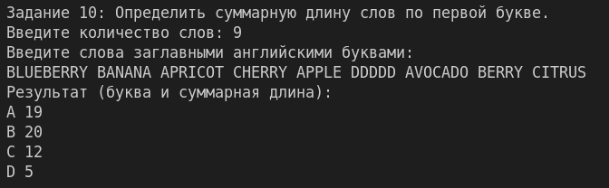

## ЛР №2

## Группа: ИТ-5-2024

## ФИО: Чугаев Евгений Игоревич

## Описание:

Решение всех задач оформить в виде функций, решающими поставленные задачи. В главной функции
main организовать вызов всех функций с дружественным интерфейсом. Если исходные данные
вводятся с клавиатуры, то организовать проверку на ввод.
В заданиях 1, 2, 3 элементами контейнеров являются целые числа. Для заполнения контейнера
использовать итератор и конструктор соответствующего контейнера, для вывода элементов
использовать итератор (для вывода элементов в обратном порядке использовать обратные
итераторы, возвращаемые функциями-членами rbegin и rend).
В задании 4 обработка данных выполняется без использования контейнеров. Если алгоритм требует
применения функционального объекта, следует использовать лямбда-выражения. Использовать
итераторы istream_iterator и ostream_iterator.
Если в заданиях 5, 6, 7, 8, 9, 10 тип элементов контейнера не указан, то предполагается, что
элементами являются целые числа.
Необходимо решить по 1 задаче из каждого задания согласно вашему варианту. Задания 1-7 оценивается по
0,5 балла, задания 8-10 по 1,5 балла. Максимально за лабораторную работу можно получить 10 баллов (8
баллов за решение задач + 2 балла за оформление отчета).

Номер задания		| 1 2 3 4 5 6 7 8 9 10
Номер задачи в списке	| 4 7 1 7 6 6 3 1 1 2

---

## Задание 1: №4

Дан набор целых чисел с четным количеством элементов. Заполнить дек D исходными числами, вывести первую половину элементов дека D в обратном порядке, а затем — вторую половину (также в обратном порядке).

### Алгоритм решения:

1. Заполняем дек числами.
2. Находим середину дека.
3. Используем обратные итераторы для вывода первой половины в обратном порядке (от середины до начала).
4. Затем выводим вторую половину в обратном порядке (от конца до середины).

### Тестирование:

---

## Задание 2: №7

**Условие:**
Дан вектор V. Вставить после каждого элемента исходного вектора число –1. Использовать функцию-член insert в цикле с параметром-итератором.

### Алгоритм решения:

1. Проходим по вектору итератором i.
2. На каждой итерации вставляем -1 в позицию ++i, присваивая i результат вставки.

### Тестирование:

---

## Задание 3: №1

**Условие:**
Дан дек D с нечетным количеством элементов N (≥3). Удалить средний элемент дека. Использовать функцию-член erase.

### Алгоритм решения:

1. Вычисляем позицию среднего элемента: итератор d.begin() + N/2.
2. Удаляем элемент с помощью erase.

### Тестирование:

---

## Задание 4: №7

**Условие:**
Дана строка name и целое число K (> 0). Записать в текстовый файл с именем name K символов «*». Использовать алгоритм fill_n.

### Алгоритм решения:

1. Открываем файл на запись.
2. Используем fill_n с итератором ostream_iterator для записи K звёздочек.

### Тестирование:

## Задание 5: №6

**Условие:**
Даны вектор V и список L; вектор V имеет четное количество элементов. Продублировать последний элемент списка, совпадающий с каким-либо элементом из первой половины исходного вектора. Если список не содержит требуемых элементов, то не изменять его. Использовать алгоритм find_first_of и функцию-член insert для списка.

### Алгоритм решения:

1. Находим середину вектора.
2. С помощью find_first_of ищем в списке (с конца) элемент, присутствующий в первой половине вектора.
3. Если найден, вставляем его копию после найденного.

### Тестирование:

---

## Задание 6: №6

**Условие:**
Дано число K (0 < K < 10) и списки L1 и L2, каждый из которых содержит не менее 10 элементов. Выполнить для списка L1 циклический сдвиг элементов вправо на K позиций, а для списка L2 — циклический сдвиг влево на K позиций. Использовать алгоритм rotate и функцию advance.

### Алгоритм решения:

1. Для L1: перемещаем итератор на позицию size-K и применяем rotate.
2. Для L2: перемещаем итератор на позицию K и применяем rotate.

### Тестирование:

---

## Задание 7: №3

**Условие:**
Дан вектор V, содержащий не менее 3 элементов. Определить значения трех конечных элементов вектора после того, как вектор будет отсортирован (по возрастанию) и вывести их в порядке убывания. Использовать один вызов алгоритма partial_sort с параметром — функциональным объектом greater и алгоритм copy для вывода требуемых элементов.

### Алгоритм решения:

1. Применяем partial_sort к первым трём элементам с компаратором greater, чтобы в начале оказались три наибольших.
2. Копируем первые три элемента в выходной поток.

### Тестирование:

## Задание 8: №1

**Условие:**
Дан список L. Получить вектор V вещественных чисел, содержащий значения среднего арифметического для всех пар соседних элементов исходного списка (количество элементов вектора V должно быть на 1 меньше количества элементов списка L). Например, для исходного списка 1, 3, 4, 6 полученный вектор должен содержать значения 2.0, 3.5, 5.0. Использовать алгоритм adjacent_difference с итератором вставки и функциональным объектом, а также функцию-член erase для вектора V.

### Алгоритм решения:

1. Создаём вектор V того же размера, что и список.
2. Применяем adjacent_difference с бинарной операцией (a+b)/2.
3. Удаляем первый элемент вектора (он равен первому элементу списка).

### Тестирование:

## Задание 9: №1

**Условие:**
Дан вектор V0, целое число N (> 0) и набор векторов V1, …, VN. Известно, что размер вектора V0 не превосходит размера любого из векторов V1, …, VN. Найти количество векторов VI, I = 1, …, N, в которых содержатся все элементы вектора V0 (без учета их повторений). Использовать алгоритм includes, применяя его в цикле к двум множествам.

### Алгоритм решения:

1. Преобразуем V0 в множество.
2. Для каждого Vi создаём множество и проверяем includes.

### Тестирование:

## Задание 10: №2

**Условие:**
Дан вектор V, элементами которого являются английские слова, набранные заглавными буквами. Определить суммарную длину слов, начинающихся с одной и той же буквы, и вывести все различные буквы, с которых начинаются элементы вектора V, вместе с суммарной длиной этих элементов (в алфавитном порядке букв); длину выводить сразу после соответствующей буквы. Использовать вспомогательное отображение M, ключами которого являются начальные буквы элементов вектора V, а значениями — суммарная длина этих элементов.

### Алгоритм решения:

1. Создаём map<char, int>.
2. Для каждого слова увеличиваем M[первая буква] на длину слова.
3. Выводим map в алфавитном порядке.

### Тестирование:

