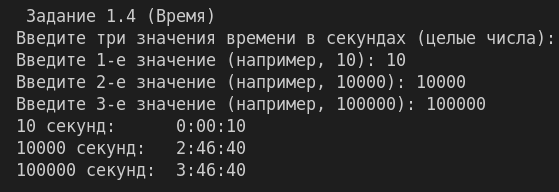
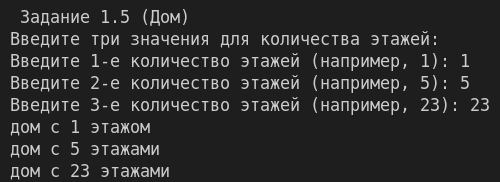
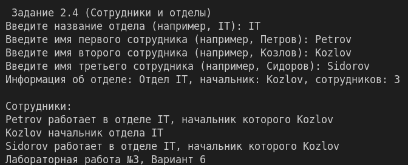
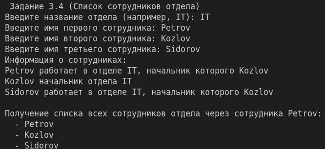
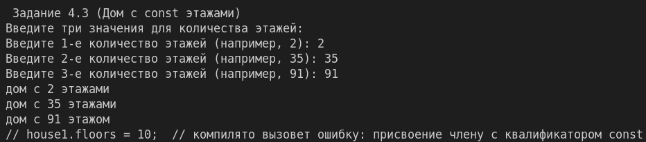
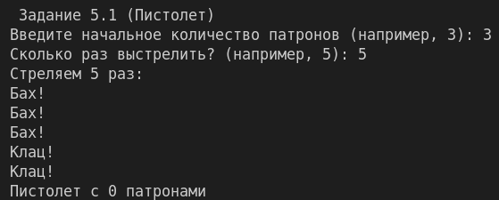

# ЛР № 3

# Вариант: 6

# Группа: ИТ-5-2024

# ФИО: Чугаев Евгений Игоревич

# Описание ЛР:

Решение всехзадач оформить в одномпроекте, но в разных классах. В главнойфункцииmain
показать работу всех классов и функцийс дружественным интерфейсом. Если исходные данные
вводятся с клавиатуры, то организовать проверку на ввод.В каждом классе должны присутствовать
свойства, конструкторы и функцияprint().
Необходимо решить заданиясогласно вашему варианту. Задания 1, 2 и 4 оцениваются по 1 баллу,
задание3 и 5-2балла. Максимально за лабораторную работу можно получить 10 баллов (8 баллов за
решение задач + 2 балла за оформление отчета).

Задания	| 1 	| 2 | 3 | 4 | 5 |

Задачи	| 4,5	| 4 | 4 | 3 | 1 |

## Задание 1. № 4

## Описание:

Время. Создайте сущность Время, которое будет описывать текущее время суток в 24-х часовом
формате. Время описывается числом секунд, прошедшим с начала суток. Время может быть
приведено к текстовой форме следующего формата: “ЧЧ:ММ:СС”. Например,если время задано как
12000, то текстовая форма будет “3:20:00”. Если общее время превышает 24 часа, то отображаться
в текстовом виде должно только то время, которое прошло с начала последних суток, например
91800, это не 25:30:00, а 1:30:00.
Необходимо создать и вывести на экран текстовую форму для следующих вариантов времени:
10 секунд
10000 секунд
100000 секунд

#### Алгоритм решения:
- Пользователь вводит три целых положительных числа (количество секунд).
- Для каждого числа создаётся объект `Time`.
- В методе `print()` вычисляются часы, минуты и секунды с использованием операции взятия остатка от деления на количество секунд в сутках (86400).
- Вывод осуществляется в формате `ЧЧ:ММ:СС` с ведущими нулями для минут и секунд.

#### Тестирование:

## Задание 1. № 5

## Описание:

Дом.
Создайте сущность Дом, которая описывается количеством этажей в виде числа. У Дома можно
запросить текстовую форму, которое имеет представление вида “дом с Nэтажами”, где Nэто
число. Гарантировать правильное окончание фразы, в зависимости от количества этажей. Создать
и вывести на экран дома с 1, 5, 23 этажами.

#### Алгоритм решения:
- Пользователь вводит три целых положительных числа.
- Для каждого числа создаётся объект `House`.
- В методе `print()` анализируется число этажей для выбора правильного окончания слова «этаж»: для чисел, оканчивающихся на 1 (кроме 11) – «этажом», для остальных – «этажами».

#### Тестирование:

## Задание 2. № 4

## Описание:

Сотрудники и отделы.
Создайте сущность Сотрудник, которая описывается именем (в строковой форме) и отделом, в
котором сотрудник работает, причем у каждого отдела есть название и начальник, который
также является Сотрудником. Сотрудник может быть приведен к текстовой форме вида: “Имя
работает  в  отделе  Название,  начальник  которого  Имя”.  В  случае  если  сотрудник  является
руководителем отдела, то текстовая форма должна быть “Имя начальник отдела Название”.
Необходимо выполнить следующие задачи:
1.Создать Сотрудников Петрова, Козлова, Сидорова работающих в отделе IT.
2.Сделать Козлова начальником ITотдела.
3.Вывести на экран текстовое представление всех трех Сотрудников (у всех троих должен
оказаться один и тот же отдел и начальник).

#### Алгоритм решения:
- Пользователь вводит название отдела и имена трёх сотрудников.
- Класс `Department` хранит название, указатель на начальника и список сотрудников.
- Класс `Employee` хранит имя и указатель на отдел. При создании сотрудник автоматически добавляется в отдел.
- Метод `setBoss()` назначает начальника отдела.
- В методе `print()` сотрудника проверяется, является ли он начальником, и выводится соответствующая строка.

#### Тестирование:

## Задание 3. № 4

## Описание:

Сотрудники и отделы.
Измените решение, полученное в задаче 2.4 (Сотрудники и отделы) таким образом, чтобы имея ссылку на сотрудника,
можно было бы узнать список всех сотрудников этого отдела.

#### Алгоритм решения:
- В классе `Department` хранится вектор `employees`, пополняемый при создании сотрудника.
- Метод `getEmployees()` возвращает ссылку на этот вектор.
- Через сотрудника можно получить его отдел (`getDepartment()`) и затем запросить список всех сотрудников отдела.

#### Тестирование:

## Задание 4. № 3

## Описание:

Создаем Дом.
Измените сущность Дом из задачи 1.5. Новые требования включают:
Создание дома может осуществляться только путем указания количества этажей.
После создания дому нельзя изменить количество этажей.
Создайте и выведите на экран дома с 2, 35, 91 этажами. Продемонстрируйте на примере что дому
нельзя заменить количество этажей.

#### Алгоритм решения:
- Поле `floors` объявлено как `const`, что запрещает его изменение после инициализации.
- Конструктор принимает количество этажей и инициализирует константное поле.
- В `main` после создания домов выводится пояснение, что попытка изменить поле приведёт к ошибке компиляции.

#### Тестирование:

## Задание 5. № 1

## Описание:

Пистолет стреляет.
Создайте сущность Пистолет, которая описывается следующим образом:
Имеет Количество патронов (целое число)
Может быть создан с указанием начального количества патронов
Может быть создан без указания начального количества патронов, вэтом случаеон
изначально заряжен пятьюпатронами.
Может Стрелять,  что  приводит  к  выводу  на  экран  текста “Бах!”в  том  случае,  если
количество патронов больше нуля, иначе делает “Клац!”. После каждого выстрела (когда
вывелся “Бах!”)количество патронов уменьшается на один.
Создайте пистолет с тремя патронами и выстрелите из него пять раз.

#### Алгоритм решения:
- Класс `Gun` имеет два конструктора: по умолчанию (5 патронов) и с параметром.
- Метод `shoot()` проверяет количество патронов, выводит соответствующий звук и уменьшает счётчик при успешном выстреле.

#### Тестирование:
