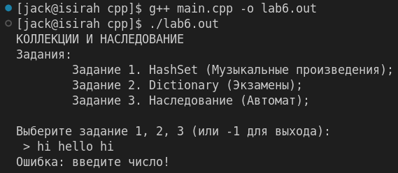
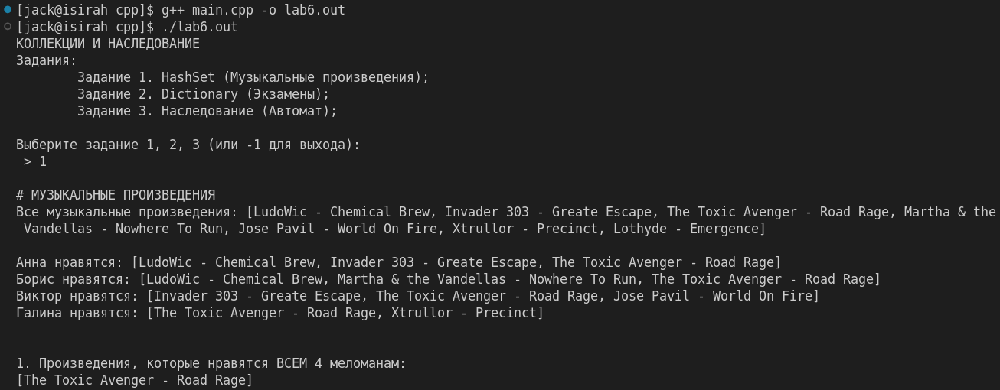
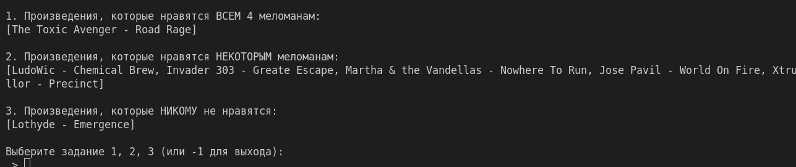
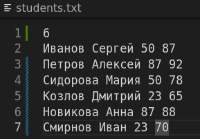
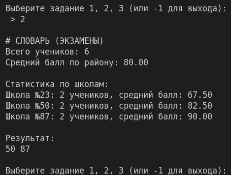
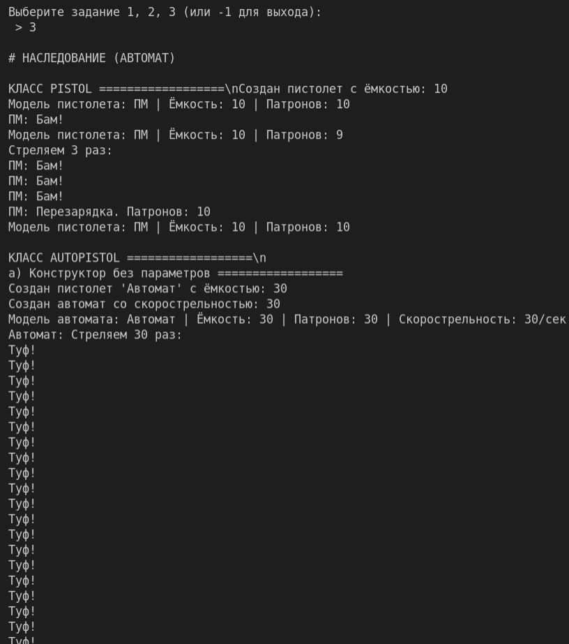
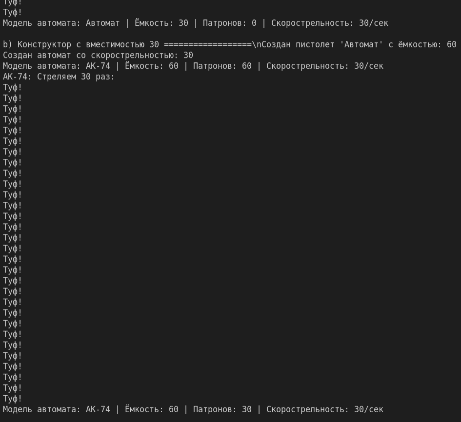
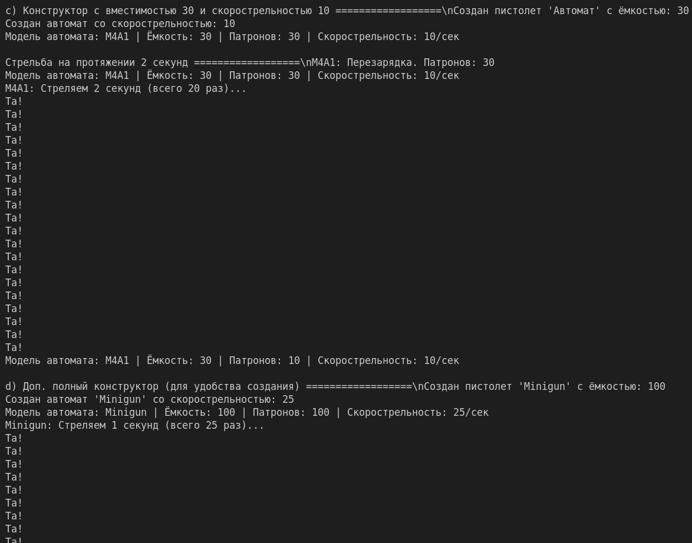
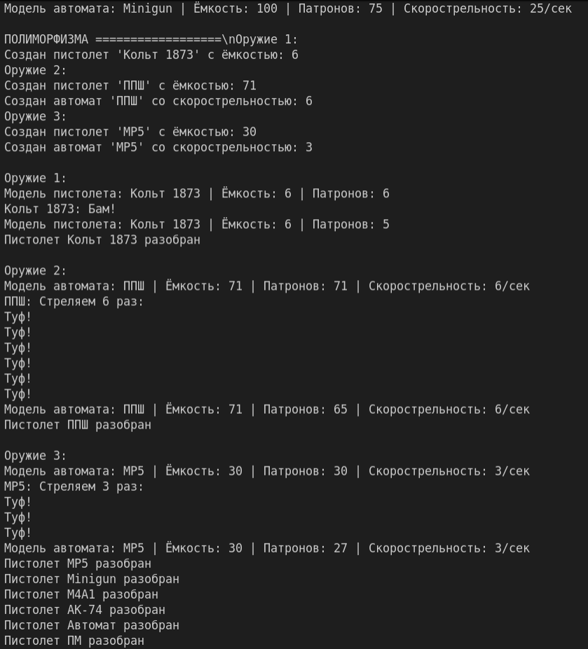

# Репозиторий лабороторных работ по дисциплине "Язык программирования C++"

# Лаб. №6 КОЛЛЕКЦИИ И НАСЛЕДОВАНИЕ

# Вариант: 6К

# Группа: ИТ-5-2024

# ФИО: Чугаев Евгений Игоревич

# Описание лабораторной работы:

Выполнить все задания в одном проекте. В классе могут присутствовать методы со спецификатором
доступа private вспомогательного характера.
В задании 1 необходимо описать класс, который реализует функционал неупорядоченного списка
(обратиться к элементу по индексу нельзя), который может содержать только уникальные элементы
(в случае добавления повторяющихся значений ошибки нет, такой элемент просто не добавляется).
Полем класса является массив. В классе должны присутствовать методы добавления и удаления
элементов, а также методы:
• Union() — объединяет две коллекции;
• Except() — позволяет удалить из первой коллекции элементы второй;
• Intersect() — получает коллекцию, состоящую из элементов, общих для двух коллекций;
• Contains() — проверяет на наличие элемента, возвращает bool.
С помощью данного класса необходимо решить задачу своего варианта.
В задании 2 необходимо описать класс, который реализует функционал словаря (запрещается
использовать готовые решения) и решить задачу своего варианта. В классе должны присутствовать
методы добавления и удаления элементов, учесть, что ключи должны быть уникальными. Исходные
данные содержаться в текстовом файле.
Классы из заданий 1 и2 должны работать при любом типе данных.
Задание 3 необходимо решить задачу с использованием наследования.
К каждому классу и методу написать xml-документацию.
Необходимо решить по 1 задаче из каждого задания согласно вашему варианту. Задание 1, 2, 3
оцениваются по 2 балла, xml-документация оценивается в 2 балла. Максимально за лабораторную
работу можно получить 10 баллов (8 баллов за решение задач + 2 балла за оформление отчета).

## Задание 1. HashSet

### Вариант задания: 6

#### Описание:

Есть перечень музыкальных произведений. Определить для каждого произведения, какие из них
нравятся всем n меломанам, какие — некоторым из меломанов, и какие — никому из меломанов.

#### Алгоритм решения:

##### Шаг 1: Подготовка исходных данных

1. Создается полный перечень всех музыкальных произведений, которые будут анализироваться.
2. Определяется количество меломанов (в данном случае 4 человека: Анна, Борис, Виктор, Галина).
3. Для каждого меломана формируется список его любимых музыкальных произведений.

##### Шаг 2: Определение произведений, которые нравятся хотя бы одному меломане

1. Начинаем с пустого списка произведений.
2. Последовательно для каждого меломана объединяем его предпочтения с текущим общим списком.
3. При объединении автоматически сохраняются только уникальные произведения (дубликаты игнорируются).
4. В результате получаем полный список всех произведений, которые нравятся хотя бы одному из меломанов.

##### Шаг 3: Определение произведений, которые нравятся всем меломанам

1. Берем список предпочтений первого меломана в качестве начального значения.
2. Последовательно для каждого следующего меломана находим пересечение его списка предпочтений с текущим общим списком.
3. Пересечение - это операция, которая оставляет только те произведения, которые присутствуют в обоих списках.
4. После обработки всех меломанов получаем список произведений, которые есть у каждого меломана (то есть нравятся всем).

##### Шаг 4: Определение произведений, которые не нравятся никому

1. Из полного перечня всех музыкальных произведений вычитаем список произведений, которые нравятся хотя бы одному меломану.
2. Вычитание - это операция, которая оставляет только те произведения из полного списка, которых нет в списке предпочтений.
3. Результат - произведения, которые никто из меломанов не отметил как любимые.

##### Шаг 5: Определение произведений, которые нравятся некоторым меломанам

1. Из списка произведений, которые нравятся хотя бы одному меломану, вычитаем список произведений, которые нравятся всем.
2. Эта операция оставляет произведения, которые есть у некоторых, но не у всех меломанов.
3. Такие произведения нравятся как минимум одному меломану, но не всем одновременно.

##### Шаг 6: Вывод результатов

1. Формируется три категории результатов:
   * Произведения, которые нравятся всем меломанам
   * Произведения, которые нравятся некоторым меломанам
   * Произведения, которые не нравятся никому из меломанов
2. Для каждой категории выводится список произведений или сообщение об отсутствии таковых.

#### Тестирование:

## Задание 2. Dictionary

### Вариант задания: 6

#### Описание:

Имеется список учеников разных школ, сдававших экзамен по информатике, с указанием их
фамилии, имени, школы и набранного балла. Напишите программу, которая будет определять
номера школ, в которых средний балл выше, чем средний по району. Если такая школа одна,
нужно вывести и средний балл (в следующей строчке). Известно, что информатику сдавали не
менее 5 учеников. Кроме того, школ с некоторыми номерами не существует.
На вход программе в первой строке подается количество учеников списке N. В каждой из
последующих N строк находится информация в следующем формате:
<Фамилия><Имя><Школа><Балл>
где <Фамилия> – строка, состоящая не более, чем из 20 символов без пробелов, <Имя>– строка,
состоящая не более, чем из 20 символов без пробелов, <Школа> – целое число от 1 до 99, <Балл> –
целое число от 1 до 100.
Пример входной строки:
Иванов Сергей 50 87
Пример выходных данных, когда найдено три школы:
50 87 23
Пример вывода в том случае, когда найдена одна школа:
18
Средний балл = 85

#### Алгоритм решения:

#### Тестирование:

##### **Шаг 1: Открытие файла и чтение первой строки**

1. Открыть файл `students.txt` для чтения.
2. **Считать первое число `N`** из файла — это количество записей об учениках.
3. Проверить, что `N > 0` (по условию, не менее 5 учеников).

##### **Шаг 2: Чтение данных учеников (ровно N записей)**

1. Организовать цикл, который выполнится ровно **`N`** раз.
2. На каждой итерации цикла:
   * Считать данные в формате: `<Фамилия> <Имя> <Школа> <Балл>`.
   * Создать объект `Student` и сохранить его в общий список.
   * **Обновить статистику по школе** в словаре `schoolData`:
     * Если школа с таким номером уже есть в словаре, добавить балл к ее общей сумме и увеличить счетчик учеников.
     * Если школы нет — создать новую запись `SchoolStats`, инициализировать ее с первым баллом и счетчиком `1`, и добавить в словарь.

##### **Шаг 3: Вычисление среднего балла по району**

1. Просуммировать баллы **всех** учеников из общего списка.
2. Разделить на общее количество учеников (`N`).
3. Получить `districtAverage`.

##### **Шаг 4: Анализ и вывод результатов**

1. Для каждого номера школы от 1 до 99:
   * Если школа есть в словаре, вычислить ее средний балл.
   * Если ее средний балл **строго больше** `districtAverage`, добавить номер школы и ее балл в списки `schoolsAboveAverage` и `schoolAverages`.
2. В зависимости от количества найденных школ:
   * **0 школ:** Вывести сообщение.
   * **1 школа:** Вывести номер школы на одной строке, а на следующей — `Средний балл = X`.
   * **>1 школ:** Вывести номера школ в одну строку через пробел.

## Задание 3. Наследование

### Вариант задания: 1

#### Описание:

Автомат. Создайте такой подвид сущности Пистолет из задачи 3.5.1, которая будет совпадать с
ней во всех отношениях, кроме следующего:
• Имеет скорострельность (целое число) которое обозначает количество выстрелов в
секунду, поддерживаемое данным автоматом. Скорострельность всегда положительное
число.
• При вызове Стрелять количество выстрелов соответствует скорострельности (например,
при скорострельности 3 выводится три строки с текстом выстрела).
• Умеет Стрелять N секунд, что приводит к количеству выстрелов равному N умноженное
на скорострельность.
• Инициализация может быть выполнены следующими способами:
a) Без параметров. Скорострельность 30, вместимость 30.
b) С указанием максимального числа патронов. Скорострельность будет равна
половине обоймы
c) С указанием максимального количества патронов в обойме и скорострельности.

#### Алгоритм решения:

##### Шаг 1: Создание базового класса Pistol

1. Определяется класс `Pistol`, представляющий базовое стрелковое оружие.
2. Класс содержит основные атрибуты:
   * `magazineCapacity` - вместимость магазина (максимальное количество патронов)
   * `bullets` - текущее количество патронов
   * `model` - модель пистолета
3. Реализуются основные методы:
   * `Shoot()` - совершает один выстрел (если есть патроны)
   * `ShootMultiple(times)` - совершает указанное количество выстрелов
   * `Reload()` - перезаряжает оружие (восполняет количество патронов)
   * `GetInfo()` - выводит информацию о состоянии оружия
4. Определяются конструкторы:
   * Конструктор по умолчанию (без параметров)
   * Конструктор с указанием вместимости магазина
   * Конструктор с вместимостью и названием модели

##### Шаг 2: Создание производного класса AutomaticPistol

1. Создается класс `AutomaticPistol`, который наследуется от класса `Pistol`.
2. Добавляется новый атрибут:
   * `fireRate` - скорострельность (количество выстрелов в секунду)
3. Переопределяются методы базового класса:
   * `Shoot()` - теперь совершает количество выстрелов, равное скорострельности
   * `GetInfo()` - добавляет информацию о скорострельности
4. Добавляются новые методы:
   * `ShootSeconds(seconds)` - стреляет в течение указанного количества секунд
5. Реализуются конструкторы в соответствии с условиями задания:
   * Без параметров (скорострельность 30, вместимость 30)
   * С указанием максимального числа патронов (скорострельность = половина обоймы)
   * С указанием вместимости и скорострельности
   * С указанием вместимости, скорострельности и названия модели

##### Шаг 3: Демонстрация работы класса Pistol

1. Создается объект пистолета с помощью конструктора по умолчанию.
2. Устанавливается название модели пистолета.
3. Выводится информация о пистолете.
4. Производится один выстрел.
5. Снова выводится информация о пистолете (для демонстрации уменьшения патронов).
6. Производится несколько выстрелов подряд.
7. Выполняется перезарядка пистолета.
8. Снова выводится информация о пистолете (для демонстрации восстановления патронов).

##### Шаг 4: Демонстрация работы класса AutomaticPistol

##### Подшаг 4.1: Конструктор без параметров

1. Создается автомат с помощью конструктора без параметров.
2. Выводится информация об автомате.
3. Производится выстрел (демонстрация скорострельности).
4. Выводится обновленная информация об автомате.

##### Подшаг 4.2: Конструктор с вместимостью

1. Создается автомат с указанием вместимости 60 патронов.
2. Устанавливается название модели.
3. Выводится информация об автомате.
4. Производится выстрел.
5. Выводится обновленная информация об автомате.

##### Подшаг 4.3: Конструктор с вместимостью и скорострельностью

1. Создается автомат с вместимостью 30 патронов и скорострельностью 10 выстрелов в секунду.
2. Устанавливается название модели.
3. Выводится информация об автомате.
4. Выполняется перезарядка.
5. Производится стрельба в течение 2 секунд.
6. Выводится информация об автомате после стрельбы.

##### Подшаг 4.4: Дополнительный конструктор

1. Создается автомат с вместимостью 100 патронов, скорострельностью 25 выстрелов в секунду и названием модели.
2. Выводится информация об автомате.
3. Производится стрельба в течение 1 секунды.
4. Выводится обновленная информация об автомате.

##### Шаг 5: Полиморфизм

1. Создается массив указателей на базовый класс `Pistol`.
2. В массив помещаются объекты разных типов:
   * Указатель на объект класса `Pistol`
   * Указатель на объект класса `AutomaticPistol` (два разных объекта)
3. Для каждого объекта в массиве:
   * Выводится информация о типе оружия
   * Вызывается метод `GetInfo()` (полиморфно, в зависимости от типа объекта)
   * Вызывается метод `Shoot()` (полиморфно)
   * Снова вызывается метод `GetInfo()` для демонстрации изменений
4. Освобождается память, выделенная для объектов.

#### Тестирование:

